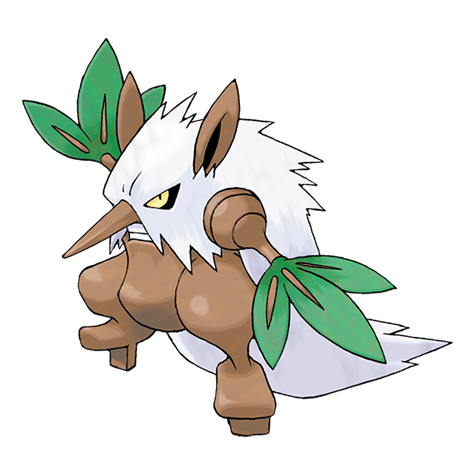

# Shiftry (#0275)

*Wicked Pokemon*

**Type:** Erba / Buio
**Abilities:** [[Chlorophyll]], [[Early Bird]], [[Pickpocket]] *(Hidden)*
**Base HP:** 5

> Feared as protectors of the forest. They are said to live atop towering trees dating back thousands of years, creating terrible wind storms. It is said they can read people’s minds to prey on their fears.

---

## Statistiche (Attributes & Limits)

| Attribute | Base / Limit |
|---|---|
| **Strength** | 3/6 |
| **Dexterity** | 2/5 |
| **Vitality** | 2/4 |
| **Special** | 2/5 |
| **Insight** | 2/4 |

---

## Mosse (Learnset)

- **Starter:** [[Feint_Attack|Feint Attack]]
- **Beginner:** [[Razor_Leaf|Razor Leaf]]
- **Amateur:** [[Nasty_Plot|Nasty Plot]], [[Whirlwind|Whirlwind]], [[Leaf_Tornado|Leaf Tornado]]
- **Ace:** [[Hurricane|Hurricane]], [[Leaf_Storm|Leaf Storm]]
- **Pro:** [[Seed_Bomb|Seed Bomb]], [[Self_Destruct|Self Destruct]], [[Sucker_Punch|Sucker Punch]]

---

## Correlati

### Catena Evolutiva
- [[0273_Seedot|Seedot]]
- [[0274_Nuzleaf|Nuzleaf]]
- [[0275_Shiftry|Shiftry]]
