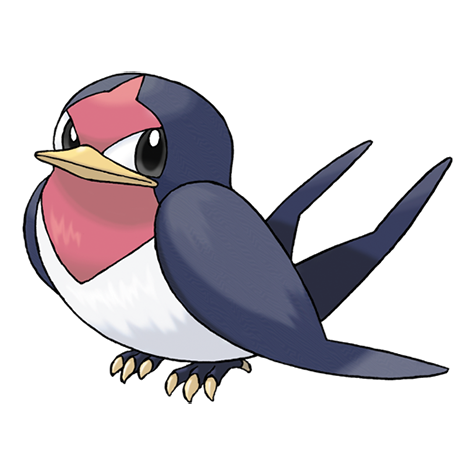

# Taillow (#0276)

*Tiny Swallow Pokemon*

**Type:** Normale / Volante
**Abilities:** [[Guts]], [[Scrappy]] *(Hidden)*
**Base HP:** 3

> They are brave and noble, facing bigger foes whoever they might be. However, being just a child, it usually feels lonely and cries at night. They can be seen migrating south in the winter.

---

## Statistiche (Attributes & Limits)

| Attribute | Base / Limit |
|---|---|
| **Strength** | 2/4 |
| **Dexterity** | 2/5 |
| **Vitality** | 1/3 |
| **Special** | 1/3 |
| **Insight** | 1/3 |

---

## Mosse (Learnset)

- **Starter:** [[Growl|Growl]]
- **Beginner:** [[Peck|Peck]], [[Focus_Energy|Focus Energy]]
- **Amateur:** [[Quick_Attack|Quick Attack]], [[Wing_Attack|Wing Attack]], [[Double_Team|Double Team]], [[Quick_Guard|Quick Guard]], [[Endeavor|Endeavor]], [[Aerial_Ace|Aerial Ace]]
- **Ace:** [[Reversal|Reversal]], [[Agility|Agility]], [[Brave_Bird|Brave Bird]], [[Air_Slash|Air Slash]]
- **Pro:** [[Endure|Endure]], [[Refresh|Refresh]], [[Rage|Rage]]

---

## Correlati

### Catena Evolutiva
- [[0276_Taillow|Taillow]]
- [[0277_Swellow|Swellow]]
