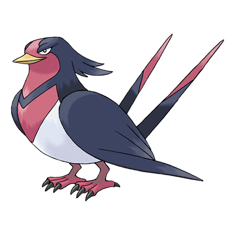

# Swellow (#0277)

*Swallow Pokemon*

**Type:** Normale / Volante
**Abilities:** [[Guts]], [[Scrappy]] *(Hidden)*
**Base HP:** 4

> They are vain Pokemon, acting with grace and elegance. Swellows are seen circling the skies looking for prey. They can be incredibly fast. If two Swellows meet, they will clean each other’s wings as a sign of peace.

---

## Statistiche (Attributes & Limits)

| Attribute | Base / Limit |
|---|---|
| **Strength** | 2/5 |
| **Dexterity** | 3/7 |
| **Vitality** | 2/4 |
| **Special** | 2/5 |
| **Insight** | 2/4 |

---

## Mosse (Learnset)

- **Starter:** [[Growl|Growl]], [[Peck|Peck]]
- **Beginner:** [[Pluck|Pluck]], [[Quick_Attack|Quick Attack]], [[Focus_Energy|Focus Energy]]
- **Amateur:** [[Double_Team|Double Team]], [[Wing_Attack|Wing Attack]], [[Endeavor|Endeavor]], [[Quick_Guard|Quick Guard]], [[Reversal|Reversal]], [[Aerial_Ace|Aerial Ace]]
- **Ace:** [[Air_Slash|Air Slash]], [[Brave_Bird|Brave Bird]], [[Agility|Agility]]
- **Pro:** [[Refresh|Refresh]], [[Sky_Attack|Sky Attack]], [[Roost|Roost]]

---

## Correlati

### Catena Evolutiva
- [[0276_Taillow|Taillow]]
- [[0277_Swellow|Swellow]]
