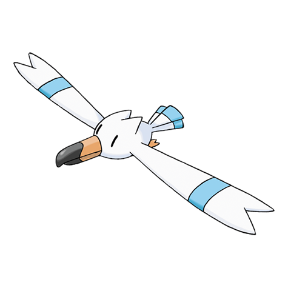

# Wingull (#0278)

*Seagull Pokemon*

**Type:** Acqua / Volante
**Abilities:** [[Keen Eye]], [[Hydration]], [[Rain Dish]] *(Hidden)*
**Base HP:** 3

> They carry prey and precious items in their beaks, hiding them in strange locations. They nest in sheer cliffs at the sea’s edge. They often harass fishing boats to steal an easy meal for themselves.

---

## Statistiche (Attributes & Limits)

| Attribute | Base / Limit |
|---|---|
| **Strength** | 1/3 |
| **Dexterity** | 2/5 |
| **Vitality** | 1/3 |
| **Special** | 2/4 |
| **Insight** | 1/3 |

---

## Mosse (Learnset)

- **Starter:** [[Growl|Growl]], [[Water_Gun|Water Gun]]
- **Beginner:** [[Supersonic|Supersonic]], [[Wing_Attack|Wing Attack]]
- **Amateur:** [[Mist|Mist]], [[Water_Pulse|Water Pulse]], [[Quick_Attack|Quick Attack]], [[Roost|Roost]], [[Pursuit|Pursuit]], [[Air_Cutter|Air Cutter]], [[Aerial_Ace|Aerial Ace]]
- **Ace:** [[Agility|Agility]], [[Air_Slash|Air Slash]], [[Hurricane|Hurricane]]
- **Pro:** [[Aqua_Ring|Aqua Ring]], [[Icy_Wind|Icy Wind]], [[Knock_Off|Knock Off]]

---

## Correlati

### Catena Evolutiva
- [[0278_Wingull|Wingull]]
- [[0279_Pelipper|Pelipper]]
