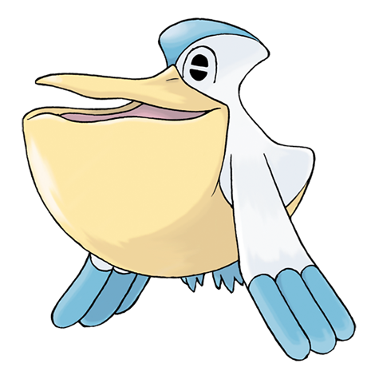

# Pelipper (#0279)

*Water Bird Pokemon*

**Type:** Acqua / Volante
**Abilities:** [[Keen Eye]], [[Drizzle]], [[Rain Dish]] *(Hidden)*
**Base HP:** 4

> Pelipper has been seen carrying eggs and other Pokemon inside its massive bill, protecting them from predators and storms, transporting the young through the great seas.

---

## Statistiche (Attributes & Limits)

| Attribute | Base / Limit |
|---|---|
| **Strength** | 2/4 |
| **Dexterity** | 2/4 |
| **Vitality** | 3/6 |
| **Special** | 2/5 |
| **Insight** | 2/5 |

---

## Mosse (Learnset)

- **Starter:** [[Growl|Growl]], [[Water_Gun|Water Gun]], [[Water_Sport|Water Sport]]
- **Beginner:** [[Supersonic|Supersonic]], [[Soak|Soak]], [[Wing_Attack|Wing Attack]]
- **Amateur:** [[Water_Pulse|Water Pulse]], [[Mist|Mist]], [[Protect|Protect]], [[Payback|Payback]], [[Brine|Brine]], [[Roost|Roost]], [[Spit_Up|Spit Up]], [[Swallow|Swallow]], [[Stockpile|Stockpile]]
- **Ace:** [[Tailwind|Tailwind]], [[Fling|Fling]], [[Hydro_Pump|Hydro Pump]], [[Hurricane|Hurricane]]
- **Pro:** [[Shock_Wave|Shock Wave]], [[Wide_Guard|Wide Guard]], [[Gunk_Shot|Gunk Shot]]

---

## Correlati

### Catena Evolutiva
- [[0278_Wingull|Wingull]]
- [[0279_Pelipper|Pelipper]]
