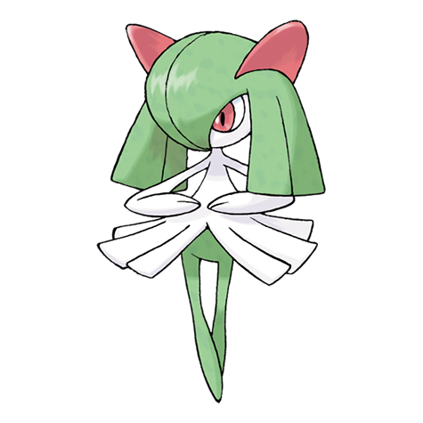

# Kirlia (#0281)

*Emotion Pokemon*

**Type:** Psico / Folletto
**Abilities:** [[Synchronize]], [[Trace]], [[Telepathy]] *(Hidden)*
**Base HP:** 4

> When they use their powers, their surroundings are distorted with mirages and illusory sceneries from the future and the past. Kirlias like to dance and dislike to be bossed around.

---

## Statistiche (Attributes & Limits)

| Attribute | Base / Limit |
|---|---|
| **Strength** | 1/3 |
| **Dexterity** | 2/4 |
| **Vitality** | 1/3 |
| **Special** | 2/4 |
| **Insight** | 2/4 |

---

## Mosse (Learnset)

- **Starter:** [[Double_Team|Double Team]], [[Growl|Growl]]
- **Beginner:** [[Confusion|Confusion]], [[Teleport|Teleport]], [[Disarming_Voice|Disarming Voice]]
- **Amateur:** [[Lucky_Chant|Lucky Chant]], [[Magical_Leaf|Magical Leaf]], [[Heal_Pulse|Heal Pulse]], [[Calm_Mind|Calm Mind]], [[Psychic|Psychic]], [[Imprison|Imprison]], [[Charm|Charm]]
- **Ace:** [[Future_Sight|Future Sight]], [[Hypnosis|Hypnosis]], [[Dream_Eater|Dream Eater]], [[Stored_Power|Stored Power]]
- **Pro:** [[Mean_Look|Mean Look]], [[Helping_Hand|Helping Hand]], [[Magic_Room|Magic Room]]

---

## Correlati

### Catena Evolutiva
- [[0280_Ralts|Ralts]]
- [[0281_Kirlia|Kirlia]]
- [[0282_Gardevoir|Gardevoir]]
- Gardevoir (Mega Form)
- Gallade
