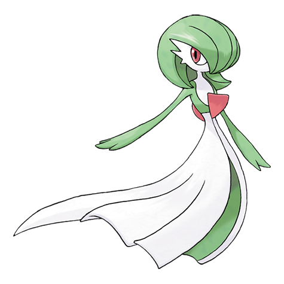
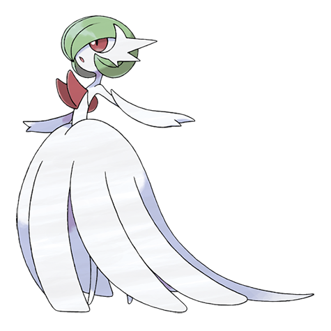

# Gardevoir (#0282)

*Embrace Pokemon*

**Type:** Psico / Folletto
**Abilities:** [[Synchronize]], [[Trace]], [[Telepathy]] *(Hidden)*
**Base HP:** 5

> If they sense danger, Gardevoir unleash a wave of psychic energy. They can distort this dimension, defy the laws of matter and physics. They risk their lives to protect their fellows.

---

## Statistiche (Attributes & Limits)

| Attribute | Base / Limit |
|---|---|
| **Strength** | 2/4 |
| **Dexterity** | 2/5 |
| **Vitality** | 2/4 |
| **Special** | 3/7 |
| **Insight** | 3/6 |

---

## Mosse (Learnset)

- **Starter:** [[Double_Team|Double Team]], [[Growl|Growl]]
- **Beginner:** [[Confusion|Confusion]], [[Disarming_Voice|Disarming Voice]], [[Teleport|Teleport]]
- **Amateur:** [[Misty_Terrain|Misty Terrain]], [[Wish|Wish]], [[Magical_Leaf|Magical Leaf]], [[Heal_Pulse|Heal Pulse]], [[Calm_Mind|Calm Mind]], [[Psychic|Psychic]], [[Imprison|Imprison]], [[Captivate|Captivate]]
- **Ace:** [[Future_Sight|Future Sight]], [[Hypnosis|Hypnosis]], [[Dream_Eater|Dream Eater]], [[Stored_Power|Stored Power]], [[Moonblast|Moonblast]]
- **Pro:** [[Grudge|Grudge]], [[Skill_Swap|Skill Swap]], [[Wonder_Room|Wonder Room]]

---

## Correlati

### Catena Evolutiva
- [[0280_Ralts|Ralts]]
- [[0281_Kirlia|Kirlia]]
- [[0282_Gardevoir|Gardevoir]]
- Gardevoir (Mega Form)
- Gallade

---

## Mega Gardevoir (#0282M1)

**Type:** Psico / Folletto
**Abilities:** [[Pixilate]]
**Base HP:** 6

| Attribute | Base / Limit |
|---|---|
| **Strength** | 2/5 |
| **Dexterity** | 3/6 |
| **Vitality** | 2/4 |
| **Special** | 4/8 |
| **Insight** | 3/7 |

### Mosse

- **Starter:** [[Double_Team|Double Team]], [[Growl|Growl]]
- **Beginner:** [[Confusion|Confusion]], [[Disarming_Voice|Disarming Voice]], [[Teleport|Teleport]]
- **Amateur:** [[Misty_Terrain|Misty Terrain]], [[Wish|Wish]], [[Magical_Leaf|Magical Leaf]], [[Heal_Pulse|Heal Pulse]], [[Calm_Mind|Calm Mind]], [[Psychic|Psychic]], [[Imprison|Imprison]], [[Captivate|Captivate]]
- **Ace:** [[Future_Sight|Future Sight]], [[Hypnosis|Hypnosis]], [[Dream_Eater|Dream Eater]], [[Stored_Power|Stored Power]], [[Moonblast|Moonblast]]
- **Pro:** [[Grudge|Grudge]], [[Skill_Swap|Skill Swap]], [[Wonder_Room|Wonder Room]]
