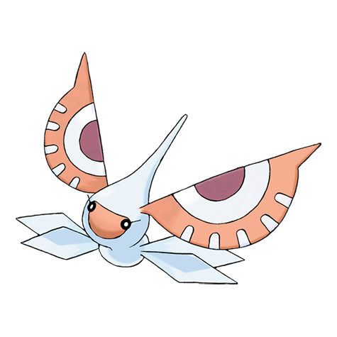

# Masquerain (#0284)

*Eyeball Pokemon*

**Type:** Insetto / Volante
**Abilities:** [[Intimidate]], [[Unnerve]] *(Hidden)*
**Base HP:** 4

> Their antennas look like terrifying eyes. Masquerains can fly in any direction like a helicopter, but their wings are soft and fragile, so they can’t fly when it’s raining. They cling to trees at night to sleep.

---

## Statistiche (Attributes & Limits)

| Attribute | Base / Limit |
|---|---|
| **Strength** | 2/4 |
| **Dexterity** | 2/5 |
| **Vitality** | 2/4 |
| **Special** | 3/6 |
| **Insight** | 2/5 |

---

## Mosse (Learnset)

- **Starter:** [[Bubble|Bubble]]
- **Beginner:** [[Sweet_Scent|Sweet Scent]], [[Quick_Attack|Quick Attack]]
- **Amateur:** [[Ominous_Wind|Ominous Wind]], [[Quiver_Dance|Quiver Dance]], [[Stun_Spore|Stun Spore]], [[Water_Sport|Water Sport]], [[Whirlwind|Whirlwind]], [[Air_Cutter|Air Cutter]], [[Gust|Gust]], [[Scary_Face|Scary Face]]
- **Ace:** [[Bug_Buzz|Bug Buzz]], [[Silver_Wind|Silver Wind]], [[Air_Slash|Air Slash]]
- **Pro:** [[Fell_Stinger|Fell Stinger]], [[Giga_Drain|Giga Drain]], [[Psybeam|Psybeam]]

---

## Correlati

### Catena Evolutiva
- [[0283_Surskit|Surskit]]
- [[0284_Masquerain|Masquerain]]
