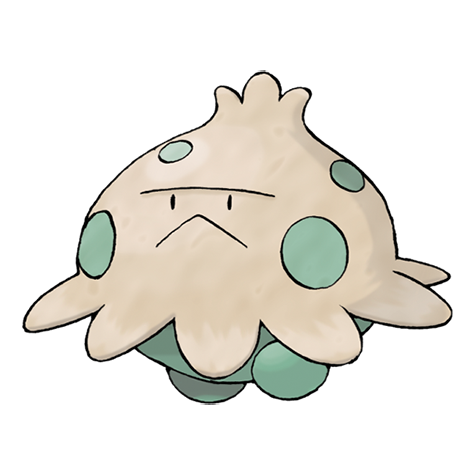

# Shroomish (#0285)

*Mushroom Pokemon*

**Type:** Erba
**Abilities:** [[Effect Spore]], [[Poison Heal]], [[Quick Feet]] *(Hidden)*
**Base HP:** 3

> They live in damp soil in forests, surrounded by moss. They suddenly release toxic spores that make plants dry up. These spores cause serious pain if inhaled. They grow taller with moisture and heat.

---

## Statistiche (Attributes & Limits)

| Attribute | Base / Limit |
|---|---|
| **Strength** | 2/4 |
| **Dexterity** | 1/3 |
| **Vitality** | 2/4 |
| **Special** | 1/3 |
| **Insight** | 2/4 |

---

## Mosse (Learnset)

- **Starter:** [[Absorb|Absorb]]
- **Beginner:** [[Tackle|Tackle]], [[Stun_Spore|Stun Spore]]
- **Amateur:** [[Leech_Seed|Leech Seed]], [[Mega_Drain|Mega Drain]], [[Headbutt|Headbutt]], [[Poison_Powder|Poison Powder]], [[Worry_Seed|Worry Seed]], [[Growth|Growth]], [[Toxic|Toxic]]
- **Ace:** [[Giga_Drain|Giga Drain]], [[Seed_Bomb|Seed Bomb]], [[Spore|Spore]]
- **Pro:** [[Charm|Charm]], [[Bullet_Seed|Bullet Seed]], [[Fake_Tears|Fake Tears]]

---

## Correlati

### Catena Evolutiva
- [[0285_Shroomish|Shroomish]]
- [[0286_Breloom|Breloom]]
