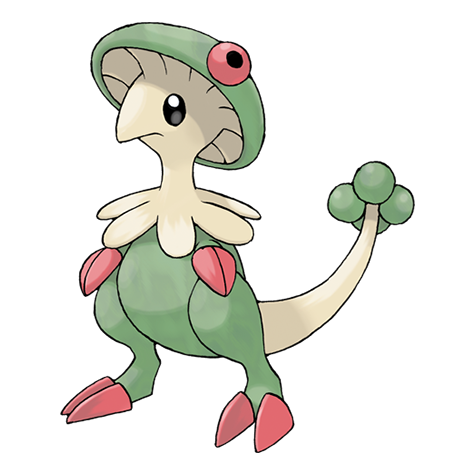

# Breloom (#0286)

*Mushroom Pokemon*

**Type:** Erba / Lotta
**Abilities:** [[Effect Spore]], [[Poison Heal]], [[Technician]] *(Hidden)*
**Base HP:** 4

> Their flexible arms and quick footwork can put good fighters to shame. The seeds on their tail and the cap on their head release poison spores. They love humid and hot climates.

---

## Statistiche (Attributes & Limits)

| Attribute | Base / Limit |
|---|---|
| **Strength** | 3/7 |
| **Dexterity** | 2/5 |
| **Vitality** | 2/5 |
| **Special** | 2/4 |
| **Insight** | 2/4 |

---

## Mosse (Learnset)

- **Starter:** [[Absorb|Absorb]]
- **Beginner:** [[Tackle|Tackle]], [[Stun_Spore|Stun Spore]]
- **Amateur:** [[Leech_Seed|Leech Seed]], [[Mega_Drain|Mega Drain]], [[Feint|Feint]], [[Headbutt|Headbutt]], [[Mach_Punch|Mach Punch]], [[Counter|Counter]], [[Force_Palm|Force Palm]], [[Mind_Reader|Mind Reader]]
- **Ace:** [[Sky_Uppercut|Sky Uppercut]], [[Seed_Bomb|Seed Bomb]], [[Dynamic_Punch|Dynamic Punch]]
- **Pro:** [[Fury_Cutter|Fury Cutter]], [[Thunder_Punch|Thunder Punch]], [[Drain_Punch|Drain Punch]]

---

## Correlati

### Catena Evolutiva
- [[0285_Shroomish|Shroomish]]
- [[0286_Breloom|Breloom]]
