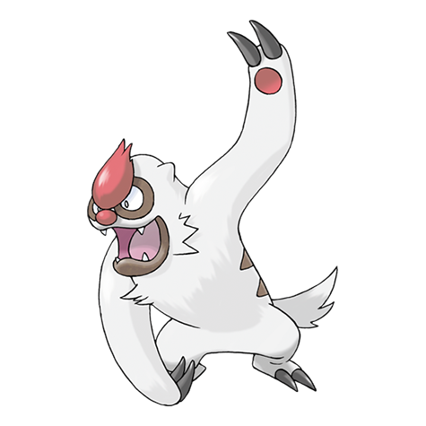

# Vigoroth (#0288)

*Wild Monkey Pokemon*

**Type:** Normale
**Abilities:** [[Vital Spirit]]
**Base HP:** 4

> They are always agitated, anxious, excited or upset, rampaging over anything. They can’t be still and they can’t sleep. They get angry if they get bored and violent if there is no activity for them.

---

## Statistiche (Attributes & Limits)

| Attribute | Base / Limit |
|---|---|
| **Strength** | 2/5 |
| **Dexterity** | 2/5 |
| **Vitality** | 2/5 |
| **Special** | 2/4 |
| **Insight** | 2/4 |

---

## Mosse (Learnset)

- **Starter:** [[Scratch|Scratch]]
- **Beginner:** [[Encore|Encore]]
- **Amateur:** [[Reversal|Reversal]], [[Focus_Energy|Focus Energy]], [[Uproar|Uproar]], [[Fury_Swipes|Fury Swipes]], [[Endure|Endure]], [[Slash|Slash]]
- **Ace:** [[Counter|Counter]], [[Chip_Away|Chip Away]], [[Focus_Punch|Focus Punch]]
- **Pro:** [[Crush_Claw|Crush Claw]], [[Sucker_Punch|Sucker Punch]], [[Night_Slash|Night Slash]]

---

## Correlati

### Catena Evolutiva
- [[0287_Slakoth|Slakoth]]
- [[0288_Vigoroth|Vigoroth]]
- [[0289_Slaking|Slaking]]
