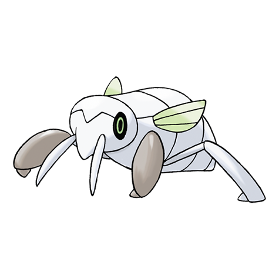

# Nincada (#0290)

*Trainee Pokemon*

**Type:** Insetto / Terra
**Abilities:** [[Compound Eyes]], [[Run Away]] *(Hidden)*
**Base HP:** 3

> They live underground for decades, absorbing nutrients from roots and waiting for evolution. Nincadas are nearly blind and cannot stand bright lights. They only come out to make a cocoon to evolve.

---

## Statistiche (Attributes & Limits)

| Attribute | Base / Limit |
|---|---|
| **Strength** | 2/4 |
| **Dexterity** | 1/3 |
| **Vitality** | 2/5 |
| **Special** | 1/3 |
| **Insight** | 1/3 |

---

## Mosse (Learnset)

- **Starter:** [[Harden|Harden]], [[Scratch|Scratch]]
- **Beginner:** [[Leech_Life|Leech Life]], [[Sand_Attack|Sand Attack]]
- **Amateur:** [[Fury_Swipes|Fury Swipes]], [[Mind_Reader|Mind Reader]], [[False_Swipe|False Swipe]], [[Bide|Bide]]
- **Ace:** [[Mud_Slap|Mud Slap]], [[Metal_Claw|Metal Claw]], [[Dig|Dig]]
- **Pro:** [[Silver_Wind|Silver Wind]], [[Giga_Drain|Giga Drain]], [[Endure|Endure]]

---

## Correlati

### Catena Evolutiva
- [[0290_Nincada|Nincada]]
- [[0291_Ninjask|Ninjask]]
- [[0292_Shedinja|Shedinja]]
