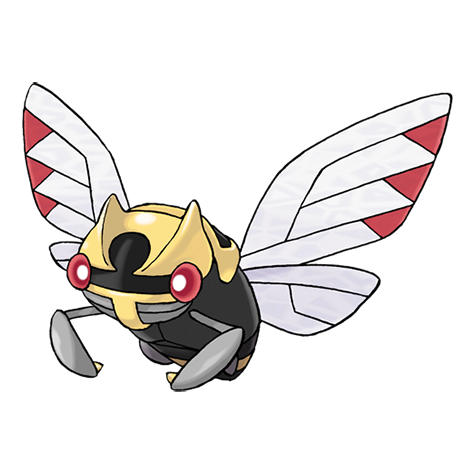

# Ninjask (#0291)

*Ninja Pokemon*

**Type:** Insetto / Volante
**Abilities:** [[Speed Boost]], [[Infiltrator]] *(Hidden)*
**Base HP:** 4

> Due to their speed and stealthiness, this Pokemon was believed to be invisible. They refuse to obey people and cry continuously if forced. People burn their cocoons as they are said to be cursed.

---

## Statistiche (Attributes & Limits)

| Attribute | Base / Limit |
|---|---|
| **Strength** | 2/5 |
| **Dexterity** | 4/8 |
| **Vitality** | 2/4 |
| **Special** | 2/4 |
| **Insight** | 2/4 |

---

## Mosse (Learnset)

- **Starter:** [[Scratch|Scratch]], [[Harden|Harden]]
- **Beginner:** [[Absorb|Absorb]], [[Sand_Attack|Sand Attack]], [[Bug_Bite|Bug Bite]]
- **Amateur:** [[Fury_Swipes|Fury Swipes]], [[Mind_Reader|Mind Reader]], [[Double_Team|Double Team]], [[Fury_Cutter|Fury Cutter]], [[Screech|Screech]], [[Slash|Slash]]
- **Ace:** [[Swords_Dance|Swords Dance]], [[Agility|Agility]], [[Baton_Pass|Baton Pass]], [[X_Scissor|X-Scissor]]
- **Pro:** [[Silver_Wind|Silver Wind]], [[Night_Slash|Night Slash]], [[Final_Gambit|Final Gambit]]

---

## Correlati

### Catena Evolutiva
- [[0290_Nincada|Nincada]]
- [[0291_Ninjask|Ninjask]]
- [[0292_Shedinja|Shedinja]]
