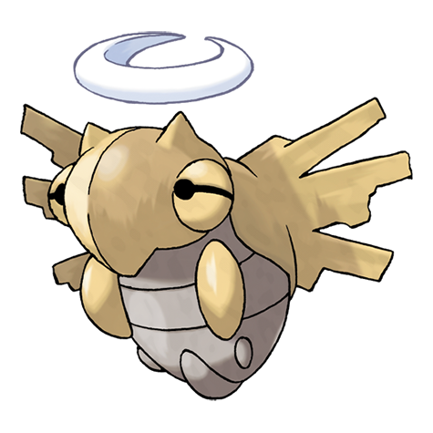

# Shedinja (#0292)

*Shed Pokemon*

**Type:** Insetto / Spettro
**Abilities:** [[Wonder Guard]]
**Base HP:** 1

> On extremely rare occasions; when Nincada evolves, the empty cocoon comes to life. They don’t move, they only float unnaturally around. It is said that it will steal the soul of anyone looking directly at them.

---

## Statistiche (Attributes & Limits)

| Attribute | Base / Limit |
|---|---|
| **Strength** | 2/5 |
| **Dexterity** | 1/3 |
| **Vitality** | 2/4 |
| **Special** | 1/3 |
| **Insight** | 1/3 |

---

## Mosse (Learnset)

- **Starter:** [[Harden|Harden]], [[Scratch|Scratch]]
- **Beginner:** [[Absorb|Absorb]], [[Sand_Attack|Sand Attack]]
- **Amateur:** [[Fury_Swipes|Fury Swipes]], [[Mind_Reader|Mind Reader]], [[Spite|Spite]], [[Confuse_Ray|Confuse Ray]], [[Shadow_Sneak|Shadow Sneak]], [[Grudge|Grudge]]
- **Ace:** [[Phantom_Force|Phantom Force]], [[Heal_Block|Heal Block]], [[Shadow_Ball|Shadow Ball]]
- **Pro:** [[Final_Gambit|Final Gambit]], [[Feint_Attack|Feint Attack]], [[X_Scissor|X-Scissor]]

---

## Correlati

### Catena Evolutiva
- [[0290_Nincada|Nincada]]
- [[0291_Ninjask|Ninjask]]
- [[0292_Shedinja|Shedinja]]
