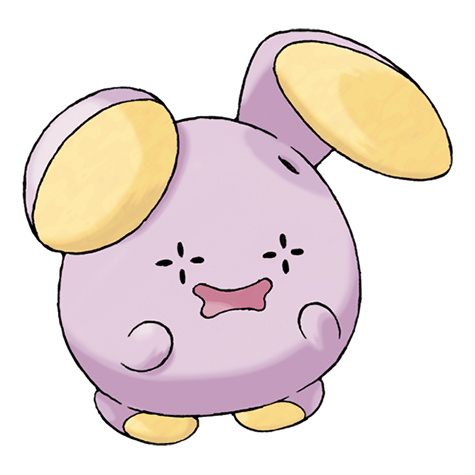

# Whismur (#0293)

*Whisper Pokemon*

**Type:** Normale
**Abilities:** [[Soundproof]], [[Rattled]] *(Hidden)*
**Base HP:** 3

> Their timid voice is barely audible, however, if it senses danger, they start crying loud enough to deafen anyone nearby. Their own noise scares them even more, so they cry harder until their ear covers shut.

---

## Statistiche (Attributes & Limits)

| Attribute | Base / Limit |
|---|---|
| **Strength** | 2/4 |
| **Dexterity** | 1/3 |
| **Vitality** | 1/3 |
| **Special** | 2/5 |
| **Insight** | 1/3 |

---

## Mosse (Learnset)

- **Starter:** [[Pound|Pound]]
- **Beginner:** [[Echoed_Voice|Echoed Voice]], [[Uproar|Uproar]]
- **Amateur:** [[Astonish|Astonish]], [[Howl|Howl]], [[Supersonic|Supersonic]], [[Stomp|Stomp]], [[Screech|Screech]], [[Roar|Roar]]
- **Ace:** [[Synchronoise|Synchronoise]], [[Rest|Rest]], [[Sleep_Talk|Sleep Talk]], [[Hyper_Voice|Hyper Voice]]
- **Pro:** [[Disarming_Voice|Disarming Voice]], [[Fake_Tears|Fake Tears]], [[Snore|Snore]]

---

## Correlati

### Catena Evolutiva
- [[0293_Whismur|Whismur]]
- [[0294_Loudred|Loudred]]
- [[0295_Exploud|Exploud]]
