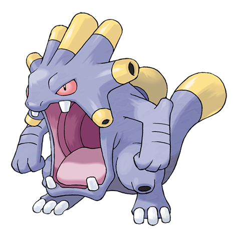

# Exploud (#0295)

*Loud Noise Pokemon*

**Type:** Normale
**Abilities:** [[Soundproof]], [[Scrappy]] *(Hidden)*
**Base HP:** 6

> It is said that some tremors are caused by the roars of this Pokemon. They communicate with soft noises, raising their voice only in battle. They can emit many different kinds of sounds.

---

## Statistiche (Attributes & Limits)

| Attribute | Base / Limit |
|---|---|
| **Strength** | 2/5 |
| **Dexterity** | 2/4 |
| **Vitality** | 1/4 |
| **Special** | 2/5 |
| **Insight** | 2/5 |

---

## Mosse (Learnset)

- **Starter:** [[Pound|Pound]]
- **Beginner:** [[Uproar|Uproar]], [[Howl|Howl]]
- **Amateur:** [[Ice_Fang|Ice Fang]], [[Fire_Fang|Fire Fang]], [[Thunder_Fang|Thunder Fang]], [[Astonish|Astonish]], [[Echoed_Voice|Echoed Voice]], [[Bite|Bite]], [[Supersonic|Supersonic]], [[Stomp|Stomp]], [[Screech|Screech]], [[Crunch|Crunch]], [[Roar|Roar]], [[Sleep_Talk|Sleep Talk]]
- **Ace:** [[Synchronoise|Synchronoise]], [[Rest|Rest]], [[Hyper_Voice|Hyper Voice]], [[Hyper_Beam|Hyper Beam]], [[Boomburst|Boomburst]]
- **Pro:** [[Outrage|Outrage]], [[Circle_Throw|Circle Throw]], [[Whirlpool|Whirlpool]]

---

## Correlati

### Catena Evolutiva
- [[0293_Whismur|Whismur]]
- [[0294_Loudred|Loudred]]
- [[0295_Exploud|Exploud]]
