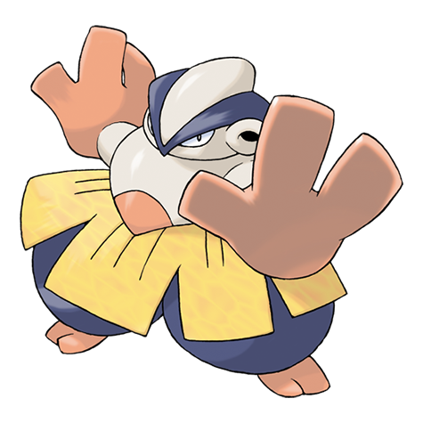

# Hariyama (#0297)

*Arm Thrust Pokemon*

**Type:** Lotta
**Abilities:** [[Thick Fat]], [[Guts]], [[Sheer Force]] *(Hidden)*
**Base HP:** 7

> They may appear fat, but they are pure muscle. Hariyamas have the habit of challenging big looking creatures to tests of strength, sometimes mistaking cars and machines for real Pokemon.

---

## Statistiche (Attributes & Limits)

| Attribute | Base / Limit |
|---|---|
| **Strength** | 3/7 |
| **Dexterity** | 2/4 |
| **Vitality** | 2/4 |
| **Special** | 1/3 |
| **Insight** | 2/4 |

---

## Mosse (Learnset)

- **Starter:** [[Focus_Energy|Focus Energy]], [[Tackle|Tackle]]
- **Beginner:** [[Arm_Thrust|Arm Thrust]], [[Sand_Attack|Sand Attack]], [[Vital_Throw|Vital Throw]]
- **Amateur:** [[Brine|Brine]], [[Fake_Out|Fake Out]], [[Whirlwind|Whirlwind]], [[Knock_Off|Knock Off]], [[Smelling_Salts|Smelling Salts]], [[Belly_Drum|Belly Drum]], [[Force_Palm|Force Palm]], [[Seismic_Toss|Seismic Toss]], [[Wake_Up_Slap|Wake-Up Slap]]
- **Ace:** [[Endure|Endure]], [[Close_Combat|Close Combat]], [[Reversal|Reversal]], [[Heavy_Slam|Heavy Slam]]
- **Pro:** [[Ice_Punch|Ice Punch]], [[Bullet_Punch|Bullet Punch]], [[Wide_Guard|Wide Guard]]

---

## Correlati

### Catena Evolutiva
- [[0296_Makuhita|Makuhita]]
- [[0297_Hariyama|Hariyama]]
