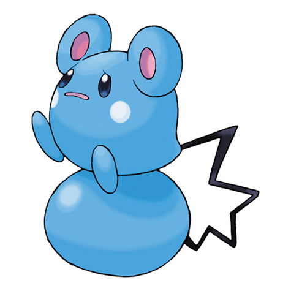

# Azurill (#0298)

*Polka Dot Pokemon*

**Type:** Normale / Folletto
**Abilities:** [[Thick Fat]], [[Huge Power]], [[Sap Sipper]] *(Hidden)*
**Base HP:** 3

> They use their tail as a lasso. When they throw their ball, Azurills get dragged along with it. They are commonly seen bouncing and playing with other Pokemon in the beach. They love fruit paps.

---

## Statistiche (Attributes & Limits)

| Attribute | Base / Limit |
|---|---|
| **Strength** | 1/3 |
| **Dexterity** | 1/3 |
| **Vitality** | 1/3 |
| **Special** | 1/3 |
| **Insight** | 1/3 |

---

## Mosse (Learnset)

- **Starter:** [[Splash|Splash]], [[Water_Gun|Water Gun]]
- **Beginner:** [[Tail_Whip|Tail Whip]], [[Water_Sport|Water Sport]], [[Bubble|Bubble]], [[Charm|Charm]]
- **Amateur:** [[Bubble_Beam|Bubble Beam]], [[Helping_Hand|Helping Hand]], [[Slam|Slam]]
- **Ace:** [[Bounce|Bounce]]
- **Pro:** [[Tickle|Tickle]], [[Sing|Sing]], [[Fake_Tears|Fake Tears]]

---

## Correlati

### Catena Evolutiva
- [[0298_Azurill|Azurill]]
- [[0183_Marill|Marill]]
