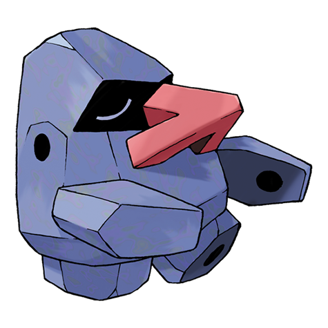

# Nosepass (#0299)

*Nosepass Pokemon*

**Type:** Roccia
**Abilities:** [[Sturdy]], [[Magnet Pull]], [[Sand Force]] *(Hidden)*
**Base HP:** 3

> Their magnetic noses always point to the north. They were thought to be immobile, but it was recently revealed that they actually move 3/8 of an inch every year. They get a little crazy when magnets are close.

---

## Statistiche (Attributes & Limits)

| Attribute | Base / Limit |
|---|---|
| **Strength** | 2/4 |
| **Dexterity** | 1/3 |
| **Vitality** | 3/7 |
| **Special** | 2/4 |
| **Insight** | 2/5 |

---

## Mosse (Learnset)

- **Starter:** [[Tackle|Tackle]]
- **Beginner:** [[Harden|Harden]], [[Block|Block]], [[Rock_Throw|Rock Throw]]
- **Amateur:** [[Thunder_Wave|Thunder Wave]], [[Rock_Blast|Rock Blast]], [[Rest|Rest]], [[Spark|Spark]], [[Rock_Slide|Rock Slide]], [[Power_Gem|Power Gem]], [[Sandstorm|Sandstorm]]
- **Ace:** [[Discharge|Discharge]], [[Earth_Power|Earth Power]], [[Stone_Edge|Stone Edge]], [[Lock_On|Lock-On]], [[Zap_Cannon|Zap Cannon]]
- **Pro:** [[Stealth_Rock|Stealth Rock]], [[Self_Destruct|Self Destruct]], [[Magic_Coat|Magic Coat]]

---

## Correlati

### Catena Evolutiva
- [[0299_Nosepass|Nosepass]]
- Probopass
