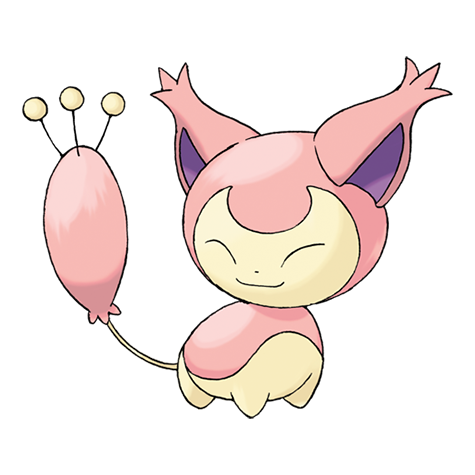

# Skitty (#0300)

*Kitten Pokemon*

**Type:** Normale
**Abilities:** [[Cute Charm]], [[Normalize]], [[Wonder Skin]] *(Hidden)*
**Base HP:** 3

> They are fascinated by moving objects, even chasing their own tail without hesitation. They are cute by nature, and popular pets, but it’s hard to earn their trust in the wild. They are quite affectionate.

---

## Statistiche (Attributes & Limits)

| Attribute | Base / Limit |
|---|---|
| **Strength** | 2/4 |
| **Dexterity** | 2/5 |
| **Vitality** | 2/4 |
| **Special** | 1/3 |
| **Insight** | 1/3 |

---

## Mosse (Learnset)

- **Starter:** [[Fake_Out|Fake Out]], [[Growl|Growl]], [[Tackle|Tackle]], [[Tail_Whip|Tail Whip]]
- **Beginner:** [[Foresight|Foresight]], [[Attract|Attract]]
- **Amateur:** [[Sing|Sing]], [[Disarming_Voice|Disarming Voice]], [[Double_Slap|Double Slap]], [[Copycat|Copycat]], [[Assist|Assist]], [[Charm|Charm]], [[Feint_Attack|Feint Attack]], [[Wake_Up_Slap|Wake-Up Slap]], [[Covet|Covet]], [[Heal_Bell|Heal Bell]]
- **Ace:** [[Double_Edge|Double-Edge]], [[Captivate|Captivate]], [[Play_Rough|Play Rough]]
- **Pro:** [[Wish|Wish]], [[Tickle|Tickle]], [[Fake_Tears|Fake Tears]]

---

## Correlati

### Catena Evolutiva
- [[0300_Skitty|Skitty]]
- [[0301_Delcatty|Delcatty]]
