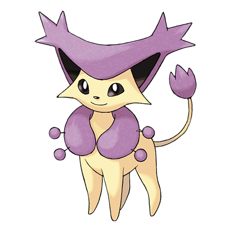

# Delcatty (#0301)

*Prim Pokemon*

**Type:** Normale
**Abilities:** [[Cute Charm]], [[Normalize]], [[Wonder Skin]] *(Hidden)*
**Base HP:** 4

> They like to live without restrictions, spending their time eating and sleeping whenever they feel like it. Popular among females. Delcatties love clean places, good food and to groom themselves.

---

## Statistiche (Attributes & Limits)

| Attribute | Base / Limit |
|---|---|
| **Strength** | 2/4 |
| **Dexterity** | 2/5 |
| **Vitality** | 2/4 |
| **Special** | 2/4 |
| **Insight** | 2/4 |

---

## Mosse (Learnset)

- **Starter:** [[Fake_Out|Fake Out]]
- **Beginner:** [[Attract|Attract]]
- **Amateur:** [[Double_Slap|Double Slap]], [[Sing|Sing]]
- **Pro:** [[Baton_Pass|Baton Pass]], [[Wish|Wish]], [[Cosmic_Power|Cosmic Power]]

---

## Correlati

### Catena Evolutiva
- [[0300_Skitty|Skitty]]
- [[0301_Delcatty|Delcatty]]
