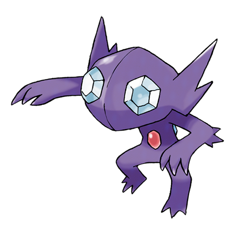

# Sableye (Mega Form) (#0302M1)

*Darkness Pokemon*

**Type:** Buio / Spettro
**Abilities:** [[Magic Bounce]]
**Base HP:** 5

> The power of the Mega Stone made the jewel on its chest grow, it now uses it as a shield to repel any attack, but its movement is limited due to how heavy it is. Its greed for the jewel can make it aggressive.

---

## Statistiche (Attributes & Limits)

| Attribute | Base / Limit |
|---|---|
| **Strength** | 2/5 |
| **Dexterity** | 1/2 |
| **Vitality** | 3/7 |
| **Special** | 3/6 |
| **Insight** | 3/7 |

---

## Mosse (Learnset)

- **Starter:** [[Leer|Leer]], [[Mean_Look|Mean Look]], [[Scratch|Scratch]], [[Zen_Headbutt|Zen Headbutt]]
- **Beginner:** [[Foresight|Foresight]], [[Night_Shade|Night Shade]]
- **Amateur:** [[Astonish|Astonish]], [[Fury_Swipes|Fury Swipes]], [[Fake_Out|Fake Out]], [[Detect|Detect]], [[Shadow_Sneak|Shadow Sneak]], [[Knock_Off|Knock Off]], [[Feint_Attack|Feint Attack]], [[Power_Gem|Power Gem]]
- **Ace:** [[Punishment|Punishment]], [[Foul_Play|Foul Play]], [[Confuse_Ray|Confuse Ray]], [[Nasty_Plot|Nasty Plot]]
- **Pro:** [[Shadow_Ball|Shadow Ball]], [[Moonlight|Moonlight]]

---
