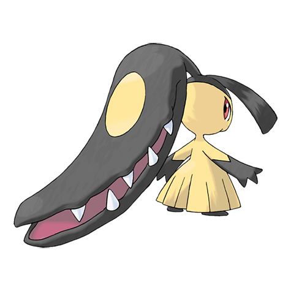

# Mawile (#0303)

*Deceiver Pokemon*

**Type:** Acciaio / Folletto
**Abilities:** [[Hyper Cutter]], [[Intimidate]], [[Sheer Force]] *(Hidden)*
**Base HP:** 4

> They appear to be cute and docile, luring their prey and lowering their guards, then, Mawile chomps the prey with huge steel jaws. They are very rare, though. Only a few have been seen in Hoenn's Victory Road.

---

## Statistiche (Attributes & Limits)

| Attribute | Base / Limit |
|---|---|
| **Strength** | 2/5 |
| **Dexterity** | 2/4 |
| **Vitality** | 2/5 |
| **Special** | 2/4 |
| **Insight** | 2/4 |

---

## Mosse (Learnset)

- **Starter:** [[Astonish|Astonish]], [[Snatch|Snatch]], [[Growl|Growl]]
- **Beginner:** [[Fairy_Wind|Fairy Wind]], [[Taunt|Taunt]], [[Fake_Tears|Fake Tears]]
- **Amateur:** [[Bite|Bite]], [[Sweet_Scent|Sweet Scent]], [[Vice_Grip|Vice Grip]], [[Feint_Attack|Feint Attack]], [[Baton_Pass|Baton Pass]], [[Crunch|Crunch]], [[Iron_Defense|Iron Defense]], [[Stockpile|Stockpile]]
- **Ace:** [[Sucker_Punch|Sucker Punch]], [[Spit_Up|Spit Up]], [[Swallow|Swallow]], [[Iron_Head|Iron Head]], [[Play_Rough|Play Rough]]
- **Pro:** [[Fire_Fang|Fire Fang]], [[Poison_Fang|Poison Fang]], [[Super_Fang|Super Fang]]

---

## Correlati

### Catena Evolutiva
- [[0303_Mawile|Mawile]]
- Mawile (Mega Form)

---

## Mega Mawile (#0303M1)

**Type:** Acciaio / Folletto
**Abilities:** [[Huge Power]]
**Base HP:** 5

| Attribute | Base / Limit |
|---|---|
| **Strength** | 3/6 |
| **Dexterity** | 2/4 |
| **Vitality** | 3/7 |
| **Special** | 2/4 |
| **Insight** | 3/6 |

### Mosse

- **Starter:** [[Astonish|Astonish]], [[Snatch|Snatch]], [[Growl|Growl]]
- **Beginner:** [[Fairy_Wind|Fairy Wind]], [[Taunt|Taunt]], [[Fake_Tears|Fake Tears]]
- **Amateur:** [[Bite|Bite]], [[Sweet_Scent|Sweet Scent]], [[Vice_Grip|Vice Grip]], [[Feint_Attack|Feint Attack]], [[Baton_Pass|Baton Pass]], [[Crunch|Crunch]], [[Iron_Defense|Iron Defense]], [[Stockpile|Stockpile]]
- **Ace:** [[Sucker_Punch|Sucker Punch]], [[Spit_Up|Spit Up]], [[Swallow|Swallow]], [[Iron_Head|Iron Head]], [[Play_Rough|Play Rough]]
- **Pro:** [[Fire_Fang|Fire Fang]], [[Poison_Fang|Poison Fang]], [[Super_Fang|Super Fang]]
