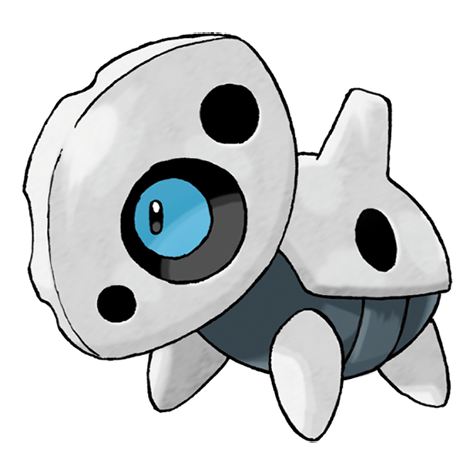

# Aron (#0304)

*Iron Armor Pokemon*

**Type:** Acciaio / Roccia
**Abilities:** [[Sturdy]], [[Rock Head]], [[Heavy Metal]] *(Hidden)*
**Base HP:** 3

> They can be seen feeding on iron ore in the mountains or causing trouble by eating rails, bridges and vehicles. When they evolve, Arons shed their steel armors and develop a stronger one.

---

## Statistiche (Attributes & Limits)

| Attribute | Base / Limit |
|---|---|
| **Strength** | 2/5 |
| **Dexterity** | 1/3 |
| **Vitality** | 3/6 |
| **Special** | 1/3 |
| **Insight** | 1/3 |

---

## Mosse (Learnset)

- **Starter:** [[Harden|Harden]], [[Tackle|Tackle]]
- **Beginner:** [[Mud_Slap|Mud Slap]], [[Take_Down|Take Down]], [[Metal_Claw|Metal Claw]]
- **Amateur:** [[Rock_Tomb|Rock Tomb]], [[Iron_Defense|Iron Defense]], [[Roar|Roar]], [[Headbutt|Headbutt]], [[Iron_Head|Iron Head]], [[Rock_Slide|Rock Slide]], [[Protect|Protect]], [[Metal_Sound|Metal Sound]], [[Iron_Tail|Iron Tail]]
- **Ace:** [[Autotomize|Autotomize]], [[Heavy_Slam|Heavy Slam]], [[Double_Edge|Double-Edge]], [[Metal_Burst|Metal Burst]]
- **Pro:** [[Screech|Screech]], [[Endeavor|Endeavor]], [[Rollout|Rollout]]

---

## Correlati

### Catena Evolutiva
- [[0304_Aron|Aron]]
- [[0305_Lairon|Lairon]]
- [[0306_Aggron|Aggron]]
- Aggron (Mega Form)
