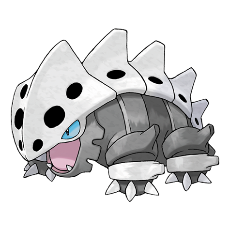

# Lairon (#0305)

*Iron Armor Pokemon*

**Type:** Acciaio / Roccia
**Abilities:** [[Sturdy]], [[Rock Head]], [[Heavy Metal]] *(Hidden)*
**Base HP:** 4

> Their armors gets stronger by eating iron ores and drinking mineral spring water, usually nesting close to ponds. Lairons often attack human miners. They are territorial creatures, incredibly stubborn and resilient.

---

## Statistiche (Attributes & Limits)

| Attribute | Base / Limit |
|---|---|
| **Strength** | 2/5 |
| **Dexterity** | 1/3 |
| **Vitality** | 3/7 |
| **Special** | 2/4 |
| **Insight** | 2/4 |

---

## Mosse (Learnset)

- **Starter:** [[Harden|Harden]], [[Tackle|Tackle]]
- **Beginner:** [[Mud_Slap|Mud Slap]], [[Take_Down|Take Down]], [[Metal_Claw|Metal Claw]]
- **Amateur:** [[Rock_Tomb|Rock Tomb]], [[Iron_Defense|Iron Defense]], [[Roar|Roar]], [[Headbutt|Headbutt]], [[Rock_Slide|Rock Slide]], [[Iron_Head|Iron Head]], [[Metal_Sound|Metal Sound]], [[Protect|Protect]], [[Iron_Tail|Iron Tail]]
- **Ace:** [[Autotomize|Autotomize]], [[Heavy_Slam|Heavy Slam]], [[Double_Edge|Double-Edge]], [[Rollout|Rollout]]
- **Pro:** [[Metal_Burst|Metal Burst]], [[Screech|Screech]], [[Endeavor|Endeavor]]

---

## Correlati

### Catena Evolutiva
- [[0304_Aron|Aron]]
- [[0305_Lairon|Lairon]]
- [[0306_Aggron|Aggron]]
- Aggron (Mega Form)
