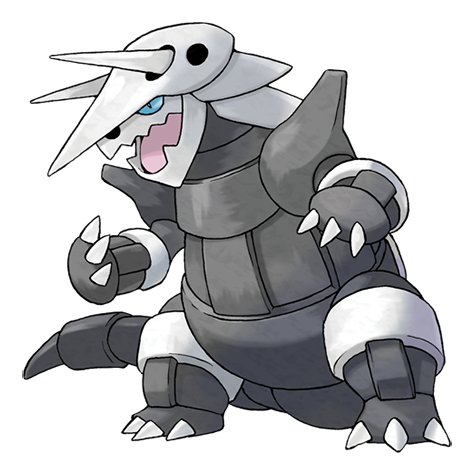
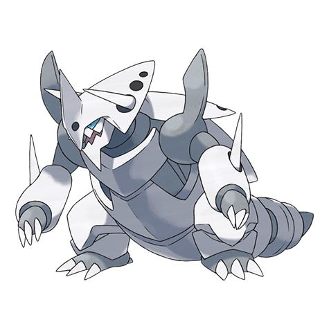

# Aggron (#0306)

*Iron Armor Pokemon*

**Type:** Acciaio / Roccia
**Abilities:** [[Sturdy]], [[Rock Head]], [[Heavy Metal]] *(Hidden)*
**Base HP:** 5

> Aggron claims ownership of entire mountains, mercilessly beating up anything that crosses their path. Aggrons are violent and patrol their territory at all times, but also plant trees, stop fires and protect nature.

---

## Statistiche (Attributes & Limits)

| Attribute | Base / Limit |
|---|---|
| **Strength** | 3/6 |
| **Dexterity** | 2/4 |
| **Vitality** | 4/9 |
| **Special** | 2/4 |
| **Insight** | 2/4 |

---

## Mosse (Learnset)

- **Starter:** [[Harden|Harden]], [[Tackle|Tackle]]
- **Beginner:** [[Mud_Slap|Mud Slap]], [[Take_Down|Take Down]], [[Metal_Claw|Metal Claw]]
- **Amateur:** [[Rock_Tomb|Rock Tomb]], [[Iron_Defense|Iron Defense]], [[Roar|Roar]], [[Headbutt|Headbutt]], [[Rock_Slide|Rock Slide]], [[Iron_Head|Iron Head]], [[Protect|Protect]], [[Metal_Sound|Metal Sound]], [[Iron_Tail|Iron Tail]]
- **Ace:** [[Autotomize|Autotomize]], [[Heavy_Slam|Heavy Slam]], [[Double_Edge|Double-Edge]], [[Metal_Burst|Metal Burst]]
- **Pro:** [[Head_Smash|Head Smash]], [[Dragon_Rush|Dragon Rush]], [[Superpower|Superpower]]

---

## Correlati

### Catena Evolutiva
- [[0304_Aron|Aron]]
- [[0305_Lairon|Lairon]]
- [[0306_Aggron|Aggron]]
- Aggron (Mega Form)

---

## Mega Aggron (#0306M1)

**Type:** Acciaio
**Abilities:** [[Filter]]
**Base HP:** 6

| Attribute | Base / Limit |
|---|---|
| **Strength** | 3/7 |
| **Dexterity** | 2/4 |
| **Vitality** | 5/11 |
| **Special** | 2/4 |
| **Insight** | 2/5 |

### Mosse

- **Starter:** [[Harden|Harden]], [[Tackle|Tackle]]
- **Beginner:** [[Mud_Slap|Mud Slap]], [[Take_Down|Take Down]], [[Metal_Claw|Metal Claw]]
- **Amateur:** [[Rock_Tomb|Rock Tomb]], [[Iron_Defense|Iron Defense]], [[Roar|Roar]], [[Headbutt|Headbutt]], [[Rock_Slide|Rock Slide]], [[Iron_Head|Iron Head]], [[Protect|Protect]], [[Metal_Sound|Metal Sound]], [[Iron_Tail|Iron Tail]]
- **Ace:** [[Autotomize|Autotomize]], [[Heavy_Slam|Heavy Slam]], [[Double_Edge|Double-Edge]], [[Metal_Burst|Metal Burst]]
- **Pro:** [[Head_Smash|Head Smash]], [[Dragon_Rush|Dragon Rush]], [[Superpower|Superpower]]
