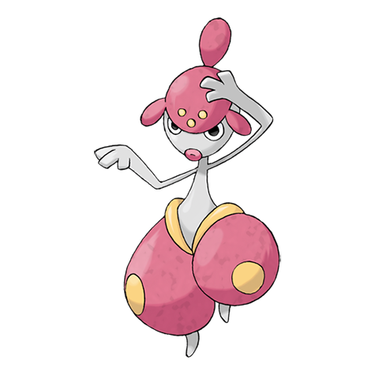

# Medicham (#0308)

*Meditate Pokemon*

**Type:** Lotta / Psico
**Abilities:** [[Pure Power]], [[Telepathy]] *(Hidden)*
**Base HP:** 4

> They are thought to posses a sixth sense. Some of them can hide their presence by lowering their ki. Medichams fight with expert yoga moves, foretelling their foe’s attacks and sensing their thoughts.

---

## Statistiche (Attributes & Limits)

| Attribute | Base / Limit |
|---|---|
| **Strength** | 2/4 |
| **Dexterity** | 2/5 |
| **Vitality** | 2/5 |
| **Special** | 2/4 |
| **Insight** | 2/5 |

---

## Mosse (Learnset)

- **Starter:** [[Bide|Bide]], [[Detect|Detect]]
- **Beginner:** [[Confusion|Confusion]], [[Meditate|Meditate]], [[Endure|Endure]]
- **Amateur:** [[Ice_Punch|Ice Punch]], [[Thunder_Punch|Thunder Punch]], [[Zen_Headbutt|Zen Headbutt]], [[Fire_Punch|Fire Punch]], [[Hidden_Power|Hidden Power]], [[Mind_Reader|Mind Reader]], [[Feint|Feint]], [[Calm_Mind|Calm Mind]], [[Force_Palm|Force Palm]], [[High_Jump_Kick|High Jump Kick]]
- **Ace:** [[Psych_Up|Psych Up]], [[Acupressure|Acupressure]], [[Power_Trick|Power Trick]], [[Reversal|Reversal]], [[Recover|Recover]], [[Counter|Counter]]
- **Pro:** [[Drain_Punch|Drain Punch]], [[Gravity|Gravity]], [[Baton_Pass|Baton Pass]]

---

## Correlati

### Catena Evolutiva
- [[0307_Meditite|Meditite]]
- [[0308_Medicham|Medicham]]
- Medicham (Mega Form)

---

## Mega Medicham (#0308M1)

**Type:** Lotta / Psico
**Abilities:** [[Pure Power]]
**Base HP:** 5

| Attribute | Base / Limit |
|---|---|
| **Strength** | 3/6 |
| **Dexterity** | 3/6 |
| **Vitality** | 3/6 |
| **Special** | 2/5 |
| **Insight** | 3/6 |

### Mosse

- **Starter:** [[Bide|Bide]], [[Detect|Detect]]
- **Beginner:** [[Confusion|Confusion]], [[Meditate|Meditate]], [[Endure|Endure]]
- **Amateur:** [[Ice_Punch|Ice Punch]], [[Thunder_Punch|Thunder Punch]], [[Zen_Headbutt|Zen Headbutt]], [[Fire_Punch|Fire Punch]], [[Hidden_Power|Hidden Power]], [[Mind_Reader|Mind Reader]], [[Feint|Feint]], [[Calm_Mind|Calm Mind]], [[Force_Palm|Force Palm]], [[High_Jump_Kick|High Jump Kick]]
- **Ace:** [[Psych_Up|Psych Up]], [[Acupressure|Acupressure]], [[Power_Trick|Power Trick]], [[Reversal|Reversal]], [[Recover|Recover]], [[Counter|Counter]]
- **Pro:** [[Drain_Punch|Drain Punch]], [[Gravity|Gravity]], [[Baton_Pass|Baton Pass]]
