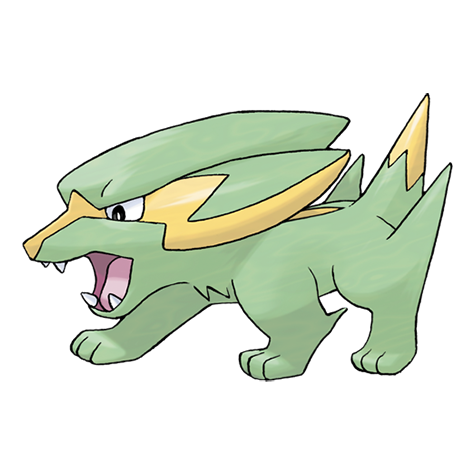

# Electrike (#0309)

*Lightning Pokemon*

**Type:** Elettro
**Abilities:** [[Static]], [[Lightning Rod]], [[Minus]] *(Hidden)*
**Base HP:** 3

> Their fur stores electricity, leaving a trail of sparks as they run. By stimulating their legs with voltage, Electrike's speed and power is greatly increased. They are not very common, though.

---

## Statistiche (Attributes & Limits)

| Attribute | Base / Limit |
|---|---|
| **Strength** | 2/4 |
| **Dexterity** | 2/4 |
| **Vitality** | 1/3 |
| **Special** | 2/4 |
| **Insight** | 1/3 |

---

## Mosse (Learnset)

- **Starter:** [[Tackle|Tackle]], [[Leer|Leer]]
- **Beginner:** [[Thunder_Wave|Thunder Wave]], [[Howl|Howl]]
- **Amateur:** [[Quick_Attack|Quick Attack]], [[Spark|Spark]], [[Odor_Sleuth|Odor Sleuth]], [[Bite|Bite]], [[Thunder_Fang|Thunder Fang]], [[Roar|Roar]]
- **Ace:** [[Discharge|Discharge]], [[Charge|Charge]], [[Wild_Charge|Wild Charge]], [[Thunder|Thunder]]
- **Pro:** [[Ice_Fang|Ice Fang]], [[Eerie_Impulse|Eerie Impulse]], [[Crunch|Crunch]]

---

## Correlati

### Catena Evolutiva
- [[0309_Electrike|Electrike]]
- [[0310_Manectric|Manectric]]
- Manectric (Mega Form)
