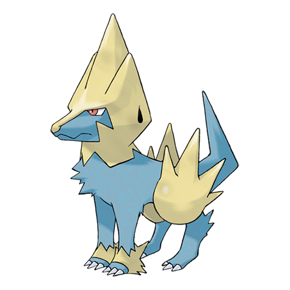
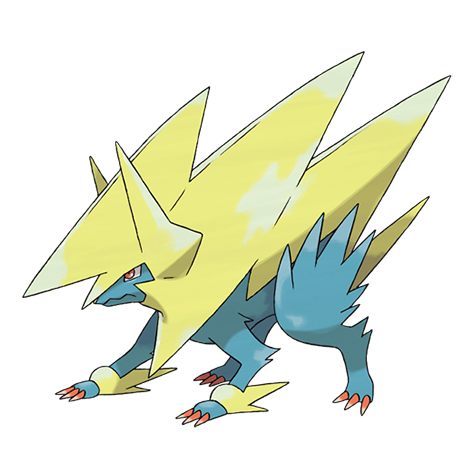

# Manectric (#0310)

*Discharge Pokemon*

**Type:** Elettro
**Abilities:** [[Static]], [[Lightning Rod]], [[Minus]] *(Hidden)*
**Base HP:** 4

> Their manes are constantly releasing dangerous sparks that often end up in forest fires. When they get in battle, thunderclouds show up with them. They are extremely rare to see in the wild.

---

## Statistiche (Attributes & Limits)

| Attribute | Base / Limit |
|---|---|
| **Strength** | 2/5 |
| **Dexterity** | 3/6 |
| **Vitality** | 2/4 |
| **Special** | 3/6 |
| **Insight** | 2/4 |

---

## Mosse (Learnset)

- **Starter:** [[Tackle|Tackle]], [[Leer|Leer]]
- **Beginner:** [[Howl|Howl]], [[Thunder_Wave|Thunder Wave]]
- **Amateur:** [[Electric_Terrain|Electric Terrain]], [[Fire_Fang|Fire Fang]], [[Quick_Attack|Quick Attack]], [[Spark|Spark]], [[Odor_Sleuth|Odor Sleuth]], [[Bite|Bite]], [[Thunder_Fang|Thunder Fang]], [[Roar|Roar]]
- **Ace:** [[Discharge|Discharge]], [[Charge|Charge]], [[Wild_Charge|Wild Charge]], [[Thunder|Thunder]]
- **Pro:** [[Ice_Fang|Ice Fang]], [[Magnet_Rise|Magnet Rise]], [[Crunch|Crunch]]

---

## Correlati

### Catena Evolutiva
- [[0309_Electrike|Electrike]]
- [[0310_Manectric|Manectric]]
- Manectric (Mega Form)

---

## Mega Manectric (#0310M1)

**Type:** Elettro
**Abilities:** [[Intimidate]]
**Base HP:** 5

| Attribute | Base / Limit |
|---|---|
| **Strength** | 2/5 |
| **Dexterity** | 3/7 |
| **Vitality** | 2/5 |
| **Special** | 3/7 |
| **Insight** | 2/5 |

### Mosse

- **Starter:** [[Tackle|Tackle]], [[Leer|Leer]]
- **Beginner:** [[Howl|Howl]], [[Thunder_Wave|Thunder Wave]]
- **Amateur:** [[Electric_Terrain|Electric Terrain]], [[Fire_Fang|Fire Fang]], [[Quick_Attack|Quick Attack]], [[Spark|Spark]], [[Odor_Sleuth|Odor Sleuth]], [[Bite|Bite]], [[Thunder_Fang|Thunder Fang]], [[Roar|Roar]]
- **Ace:** [[Discharge|Discharge]], [[Charge|Charge]], [[Wild_Charge|Wild Charge]], [[Thunder|Thunder]]
- **Pro:** [[Ice_Fang|Ice Fang]], [[Magnet_Rise|Magnet Rise]], [[Crunch|Crunch]]
