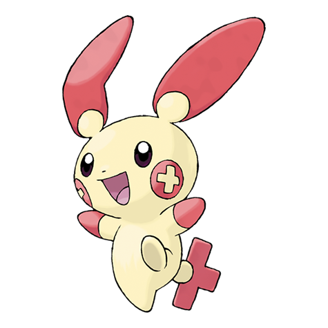

# Plusle (#0311)

*Cheering Pokemon*

**Type:** Elettro
**Abilities:** [[Plus]], [[Lightning Rod]] *(Hidden)*
**Base HP:** 4

> They are often seen cheerleading their friends. When someone they like does a great job, they shower the field with sparks, but when they lose, Plusle cries loudly. This Pokemon drains power from telephone poles.

---

## Statistiche (Attributes & Limits)

| Attribute | Base / Limit |
|---|---|
| **Strength** | 2/4 |
| **Dexterity** | 3/6 |
| **Vitality** | 1/3 |
| **Special** | 2/5 |
| **Insight** | 2/5 |

---

## Mosse (Learnset)

- **Starter:** [[Entrainment|Entrainment]], [[Growl|Growl]], [[Nasty_Plot|Nasty Plot]], [[Nuzzle|Nuzzle]], [[Charm|Charm]]
- **Beginner:** [[Thunder_Wave|Thunder Wave]], [[Quick_Attack|Quick Attack]], [[Helping_Hand|Helping Hand]]
- **Amateur:** [[Spark|Spark]], [[Encore|Encore]], [[Copycat|Copycat]], [[Electro_Ball|Electro Ball]], [[Swift|Swift]], [[Fake_Tears|Fake Tears]], [[Charge|Charge]]
- **Ace:** [[Thunder|Thunder]], [[Baton_Pass|Baton Pass]], [[Agility|Agility]], [[Last_Resort|Last Resort]]
- **Pro:** [[Sweet_Kiss|Sweet Kiss]], [[Wish|Wish]], [[Mimic|Mimic]]

---

