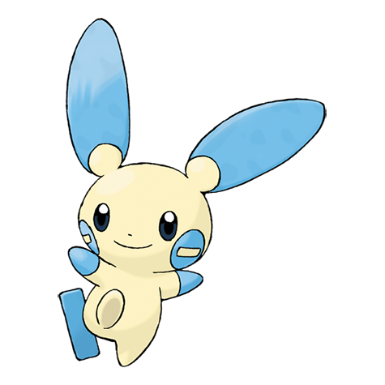

# Minun (#0312)

*Cheering Pokemon*

**Type:** Elettro
**Abilities:** [[Minus]], [[Volt Absorb]] *(Hidden)*
**Base HP:** 4

> They will cheer their friends with their lives and will keep on cheering to their last breath. If a partner is in trouble, this Pokemon will create a curtain of sparks on its friend’s side to boost its spirit.

---

## Statistiche (Attributes & Limits)

| Attribute | Base / Limit |
|---|---|
| **Strength** | 1/3 |
| **Dexterity** | 3/6 |
| **Vitality** | 2/4 |
| **Special** | 2/5 |
| **Insight** | 2/5 |

---

## Mosse (Learnset)

- **Starter:** [[Entrainment|Entrainment]], [[Growl|Growl]], [[Nasty_Plot|Nasty Plot]], [[Nuzzle|Nuzzle]], [[Charm|Charm]]
- **Beginner:** [[Thunder_Wave|Thunder Wave]], [[Quick_Attack|Quick Attack]], [[Helping_Hand|Helping Hand]]
- **Amateur:** [[Spark|Spark]], [[Encore|Encore]], [[Copycat|Copycat]], [[Electro_Ball|Electro Ball]], [[Swift|Swift]], [[Fake_Tears|Fake Tears]], [[Charge|Charge]]
- **Ace:** [[Thunder|Thunder]], [[Baton_Pass|Baton Pass]], [[Agility|Agility]], [[Trump_Card|Trump Card]]
- **Pro:** [[Sweet_Kiss|Sweet Kiss]], [[Wish|Wish]], [[Mimic|Mimic]]

---

