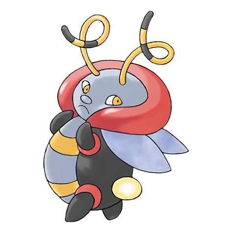

# Volbeat (#0313)

*Firelfy Pokemon*

**Type:** Insetto
**Abilities:** [[Illuminate]], [[Swarm]], [[Prankster]] *(Hidden)*
**Base HP:** 4

> The male of its species. Their tail shines bright during the night, drawing geometric shapes in the sky. Volbeats live in swarms around clean ponds. They are attracted to Illumise's sweet aroma.

---

## Statistiche (Attributes & Limits)

| Attribute | Base / Limit |
|---|---|
| **Strength** | 2/5 |
| **Dexterity** | 2/5 |
| **Vitality** | 2/5 |
| **Special** | 2/4 |
| **Insight** | 2/5 |

---

## Mosse (Learnset)

- **Starter:** [[Flash|Flash]], [[Tackle|Tackle]]
- **Beginner:** [[Double_Team|Double Team]], [[Confuse_Ray|Confuse Ray]]
- **Amateur:** [[Moonlight|Moonlight]], [[Struggle_Bug|Struggle Bug]], [[Quick_Attack|Quick Attack]], [[Tail_Glow|Tail Glow]], [[Signal_Beam|Signal Beam]], [[Protect|Protect]], [[Helping_Hand|Helping Hand]], [[Zen_Headbutt|Zen Headbutt]]
- **Ace:** [[Bug_Buzz|Bug Buzz]], [[Play_Rough|Play Rough]], [[Double_Edge|Double-Edge]], [[Infestation|Infestation]]
- **Pro:** [[Dizzy_Punch|Dizzy Punch]], [[Tailwind|Tailwind]], [[Silver_Wind|Silver Wind]]

---

