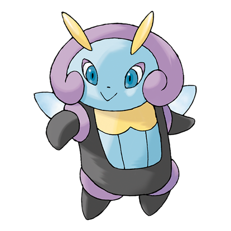

# Illumise (#0314)

*Firelfy Pokemon*

**Type:** Insetto
**Abilities:** [[Oblivious]], [[Tinted Lens]], [[Prankster]] *(Hidden)*
**Base HP:** 4

> They attract swarms of Volbeat with their sweet fragrance and organize the swarm into drawing geometric shapes made of light. Illumises gain rank in their group if they make an amazing performance.

---

## Statistiche (Attributes & Limits)

| Attribute | Base / Limit |
|---|---|
| **Strength** | 2/4 |
| **Dexterity** | 2/5 |
| **Vitality** | 2/5 |
| **Special** | 2/5 |
| **Insight** | 2/5 |

---

## Mosse (Learnset)

- **Starter:** [[Play_Nice|Play Nice]], [[Tackle|Tackle]]
- **Beginner:** [[Sweet_Scent|Sweet Scent]], [[Charm|Charm]]
- **Amateur:** [[Moonlight|Moonlight]], [[Quick_Attack|Quick Attack]], [[Struggle_Bug|Struggle Bug]], [[Wish|Wish]], [[Encore|Encore]], [[Flatter|Flatter]], [[Helping_Hand|Helping Hand]], [[Zen_Headbutt|Zen Headbutt]]
- **Ace:** [[Bug_Buzz|Bug Buzz]], [[Play_Rough|Play Rough]], [[Covet|Covet]], [[Infestation|Infestation]]
- **Pro:** [[Captivate|Captivate]], [[Tailwind|Tailwind]], [[Silver_Wind|Silver Wind]]

---

