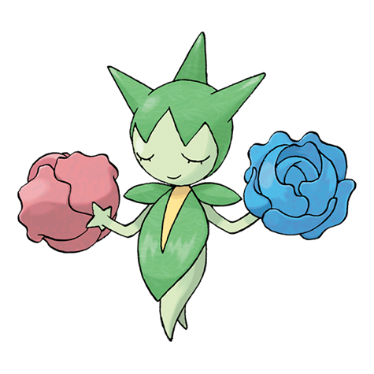

# Roselia (#0315)

*Thorn Pokemon*

**Type:** Erba / Veleno
**Abilities:** [[Natural Cure]], [[Poison Point]], [[Leaf Guard]] *(Hidden)*
**Base HP:** 4

> They live among rose bushes, shooting sharp poisonous thorns to anyone who tries to steal one of their flowers. Their aroma brings serenity. They need clean water to grow beautiful.

---

## Statistiche (Attributes & Limits)

| Attribute | Base / Limit |
|---|---|
| **Strength** | 2/4 |
| **Dexterity** | 2/4 |
| **Vitality** | 2/4 |
| **Special** | 3/6 |
| **Insight** | 2/5 |

---

## Mosse (Learnset)

- **Starter:** [[Absorb|Absorb]]
- **Beginner:** [[Growth|Growth]], [[Poison_Sting|Poison Sting]], [[Stun_Spore|Stun Spore]]
- **Amateur:** [[Mega_Drain|Mega Drain]], [[Leech_Seed|Leech Seed]], [[Magical_Leaf|Magical Leaf]], [[Grass_Whistle|Grass Whistle]], [[Giga_Drain|Giga Drain]], [[Toxic_Spikes|Toxic Spikes]], [[Sweet_Scent|Sweet Scent]], [[Ingrain|Ingrain]], [[Petal_Dance|Petal Dance]]
- **Ace:** [[Toxic|Toxic]], [[Aromatherapy|Aromatherapy]], [[Synthesis|Synthesis]], [[Petal_Blizzard|Petal Blizzard]]
- **Pro:** [[Worry_Seed|Worry Seed]], [[Spikes|Spikes]], [[Extrasensory|Extrasensory]]

---

## Correlati

### Catena Evolutiva
- [[0315_Roselia|Roselia]]
- Roserade
