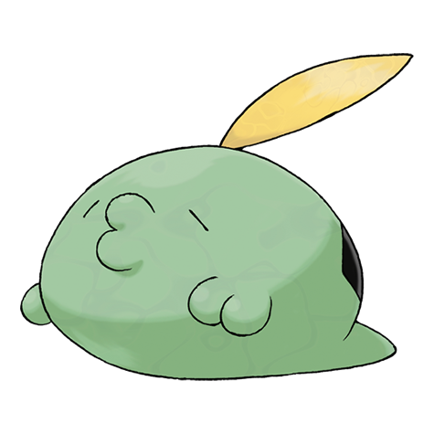

# Gulpin (#0316)

*Stomach Pokemon*

**Type:** Veleno
**Abilities:** [[Liquid Ooze]], [[Sticky Hold]], [[Gluttony]] *(Hidden)*
**Base HP:** 3

> Gulpin's body is a huge stomach capable of swallowing anything of their size. Their fluids can corrode metal. This Pokemon releases hideous and vile gases while it digests its food.

---

## Statistiche (Attributes & Limits)

| Attribute | Base / Limit |
|---|---|
| **Strength** | 1/3 |
| **Dexterity** | 1/3 |
| **Vitality** | 2/4 |
| **Special** | 1/3 |
| **Insight** | 2/4 |

---

## Mosse (Learnset)

- **Starter:** [[Pound|Pound]]
- **Beginner:** [[Yawn|Yawn]], [[Poison_Gas|Poison Gas]]
- **Amateur:** [[Sludge|Sludge]], [[Amnesia|Amnesia]], [[Encore|Encore]], [[Toxic|Toxic]], [[Acid_Spray|Acid Spray]], [[Stockpile|Stockpile]], [[Spit_Up|Spit Up]], [[Swallow|Swallow]]
- **Ace:** [[Belch|Belch]], [[Sludge_Bomb|Sludge Bomb]], [[Gastro_Acid|Gastro Acid]], [[Wring_Out|Wring Out]], [[Gunk_Shot|Gunk Shot]]
- **Pro:** [[Venom_Drench|Venom Drench]], [[Seed_Bomb|Seed Bomb]], [[Water_Pulse|Water Pulse]]

---

## Correlati

### Catena Evolutiva
- [[0316_Gulpin|Gulpin]]
- [[0317_Swalot|Swalot]]
