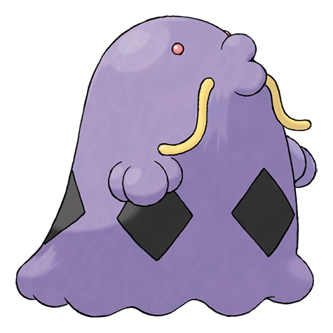

# Swalot (#0317)

*Poison Bag Pokemon*

**Type:** Veleno
**Abilities:** [[Liquid Ooze]], [[Sticky Hold]], [[Gluttony]] *(Hidden)*
**Base HP:** 5

> Swalots spurt toxic fluids from their pores, and once the prey is weak, it gets swallowed whole since they have no teeth. They may eat anything up to the size of a car’s tire. Do not get too close to them.

---

## Statistiche (Attributes & Limits)

| Attribute | Base / Limit |
|---|---|
| **Strength** | 2/5 |
| **Dexterity** | 2/4 |
| **Vitality** | 2/5 |
| **Special** | 2/5 |
| **Insight** | 2/5 |

---

## Mosse (Learnset)

- **Starter:** [[Pound|Pound]]
- **Beginner:** [[Poison_Gas|Poison Gas]], [[Yawn|Yawn]]
- **Amateur:** [[Sludge|Sludge]], [[Wring_Out|Wring Out]], [[Amnesia|Amnesia]], [[Encore|Encore]], [[Body_Slam|Body Slam]], [[Toxic|Toxic]], [[Acid_Spray|Acid Spray]], [[Stockpile|Stockpile]], [[Spit_Up|Spit Up]], [[Swallow|Swallow]]
- **Ace:** [[Belch|Belch]], [[Sludge_Bomb|Sludge Bomb]], [[Gastro_Acid|Gastro Acid]], [[Wring_Out|Wring Out]], [[Gunk_Shot|Gunk Shot]]
- **Pro:** [[Block|Block]], [[Venom_Drench|Venom Drench]], [[Self_Destruct|Self Destruct]]

---

## Correlati

### Catena Evolutiva
- [[0316_Gulpin|Gulpin]]
- [[0317_Swalot|Swalot]]
