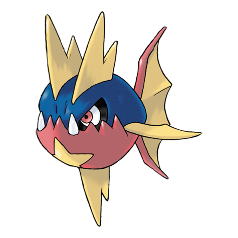

# Carvanha (#0318)

*Savage Pokemon*

**Type:** Acqua / Buio
**Abilities:** [[Rough Skin]], [[Speed Boost]] *(Hidden)*
**Base HP:** 3

> Anything near a Carvanha school will be swarmed, attacked and tore to bits. However, they are very timid when they are on their own. They live in rivers in the jungle and dislike salt water.

---

## Statistiche (Attributes & Limits)

| Attribute | Base / Limit |
|---|---|
| **Strength** | 2/5 |
| **Dexterity** | 2/4 |
| **Vitality** | 1/3 |
| **Special** | 2/4 |
| **Insight** | 1/3 |

---

## Mosse (Learnset)

- **Starter:** [[Bite|Bite]], [[Leer|Leer]]
- **Beginner:** [[Rage|Rage]], [[Focus_Energy|Focus Energy]]
- **Amateur:** [[Scary_Face|Scary Face]], [[Ice_Fang|Ice Fang]], [[Screech|Screech]], [[Swagger|Swagger]], [[Aqua_Jet|Aqua Jet]], [[Crunch|Crunch]], [[Take_Down|Take Down]]
- **Ace:** [[Poison_Fang|Poison Fang]], [[Agility|Agility]], [[Assurance|Assurance]]
- **Pro:** [[Super_Fang|Super Fang]], [[Dive|Dive]], [[Bounce|Bounce]]

---

## Correlati

### Catena Evolutiva
- [[0318_Carvanha|Carvanha]]
- [[0319_Sharpedo|Sharpedo]]
- Sharpedo (Mega Form)
