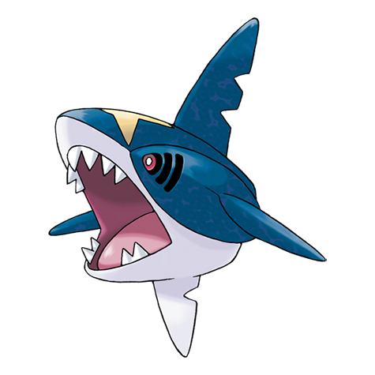
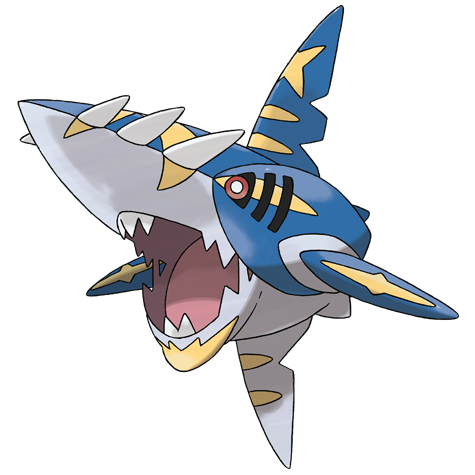

# Sharpedo (#0319)

*Brutal Pokemon*

**Type:** Acqua / Buio
**Abilities:** [[Rough Skin]], [[Speed Boost]] *(Hidden)*
**Base HP:** 4

> Known as the “Bully of the Sea”, widely feared for its cruelty, malice and gangster attitude. They hurt Pokemon for fun and sink boats for sport. Sharpedos are among the fastest swimmers.

---

## Statistiche (Attributes & Limits)

| Attribute | Base / Limit |
|---|---|
| **Strength** | 3/7 |
| **Dexterity** | 3/6 |
| **Vitality** | 1/3 |
| **Special** | 3/6 |
| **Insight** | 1/3 |

---

## Mosse (Learnset)

- **Starter:** [[Bite|Bite]], [[Leer|Leer]]
- **Beginner:** [[Focus_Energy|Focus Energy]], [[Feint|Feint]], [[Rage|Rage]]
- **Amateur:** [[Night_Slash|Night Slash]], [[Scary_Face|Scary Face]], [[Ice_Fang|Ice Fang]], [[Screech|Screech]], [[Swagger|Swagger]], [[Taunt|Taunt]], [[Crunch|Crunch]], [[Slash|Slash]], [[Aqua_Jet|Aqua Jet]]
- **Ace:** [[Poison_Fang|Poison Fang]], [[Assurance|Assurance]], [[Agility|Agility]], [[Skull_Bash|Skull Bash]]
- **Pro:** [[Hydro_Pump|Hydro Pump]], [[Psychic_Fangs|Psychic Fangs]], [[Spite|Spite]]

---

## Correlati

### Catena Evolutiva
- [[0318_Carvanha|Carvanha]]
- [[0319_Sharpedo|Sharpedo]]
- Sharpedo (Mega Form)

---

## Mega Sharpedo (#0319M1)

**Type:** Acqua / Buio
**Abilities:** [[Strong Jaw]]
**Base HP:** 5

| Attribute | Base / Limit |
|---|---|
| **Strength** | 4/8 |
| **Dexterity** | 3/6 |
| **Vitality** | 2/5 |
| **Special** | 3/6 |
| **Insight** | 2/4 |

### Mosse

- **Starter:** [[Bite|Bite]], [[Leer|Leer]]
- **Beginner:** [[Focus_Energy|Focus Energy]], [[Feint|Feint]], [[Rage|Rage]]
- **Amateur:** [[Night_Slash|Night Slash]], [[Scary_Face|Scary Face]], [[Ice_Fang|Ice Fang]], [[Screech|Screech]], [[Swagger|Swagger]], [[Taunt|Taunt]], [[Crunch|Crunch]], [[Slash|Slash]], [[Aqua_Jet|Aqua Jet]]
- **Ace:** [[Poison_Fang|Poison Fang]], [[Assurance|Assurance]], [[Agility|Agility]], [[Skull_Bash|Skull Bash]]
- **Pro:** [[Hydro_Pump|Hydro Pump]], [[Psychic_Fangs|Psychic Fangs]], [[Spite|Spite]]
