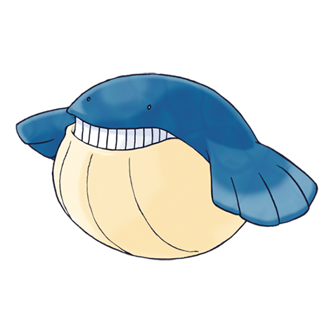

# Wailmer (#0320)

*Ball Whale Pokemon*

**Type:** Acqua
**Abilities:** [[Water Veil]], [[Oblivious]], [[Pressure]] *(Hidden)*
**Base HP:** 5

> Wailmer has a playful nature. They can store water inside their body to inflate like a ball and bounce, then startle people by snorting the water from their nostrils. This Pokemon needs lots of food everyday.

---

## Statistiche (Attributes & Limits)

| Attribute | Base / Limit |
|---|---|
| **Strength** | 2/5 |
| **Dexterity** | 2/4 |
| **Vitality** | 1/3 |
| **Special** | 2/5 |
| **Insight** | 1/3 |

---

## Mosse (Learnset)

- **Starter:** [[Splash|Splash]], [[Growl|Growl]]
- **Beginner:** [[Water_Gun|Water Gun]], [[Rollout|Rollout]]
- **Amateur:** [[Whirlpool|Whirlpool]], [[Astonish|Astonish]], [[Water_Pulse|Water Pulse]], [[Mist|Mist]], [[Dive|Dive]], [[Brine|Brine]], [[Water_Spout|Water Spout]], [[Amnesia|Amnesia]]
- **Ace:** [[Rest|Rest]], [[Bounce|Bounce]], [[Hydro_Pump|Hydro Pump]], [[Heavy_Slam|Heavy Slam]]
- **Pro:** [[Soak|Soak]], [[Clear_Smog|Clear Smog]], [[Defense_Curl|Defense Curl]]

---

## Correlati

### Catena Evolutiva
- [[0320_Wailmer|Wailmer]]
- [[0321_Wailord|Wailord]]
