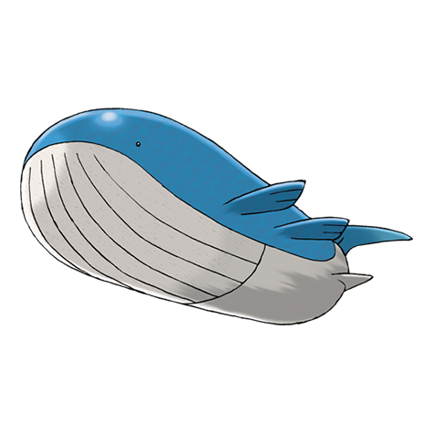

# Wailord (#0321)

*Float Whale Pokemon*

**Type:** Acqua
**Abilities:** [[Water Veil]], [[Oblivious]], [[Pressure]] *(Hidden)*
**Base HP:** 11

> The largest Pokemon known to date. Wailords weight is really light so they can dive almost 10,000 feet with one breath. They live in open ocean herding fish to swallow in one gulp. They are used to being free.

---

## Statistiche (Attributes & Limits)

| Attribute | Base / Limit |
|---|---|
| **Strength** | 2/5 |
| **Dexterity** | 2/4 |
| **Vitality** | 2/4 |
| **Special** | 2/5 |
| **Insight** | 2/4 |

---

## Mosse (Learnset)

- **Starter:** [[Splash|Splash]], [[Growl|Growl]]
- **Beginner:** [[Water_Gun|Water Gun]], [[Rollout|Rollout]], [[Noble_Roar|Noble Roar]]
- **Amateur:** [[Whirlpool|Whirlpool]], [[Astonish|Astonish]], [[Water_Pulse|Water Pulse]], [[Mist|Mist]], [[Dive|Dive]], [[Brine|Brine]], [[Water_Spout|Water Spout]], [[Amnesia|Amnesia]]
- **Ace:** [[Rest|Rest]], [[Bounce|Bounce]], [[Hydro_Pump|Hydro Pump]], [[Heavy_Slam|Heavy Slam]]
- **Pro:** [[Soak|Soak]], [[Clear_Smog|Clear Smog]], [[Defense_Curl|Defense Curl]]

---

## Correlati

### Catena Evolutiva
- [[0320_Wailmer|Wailmer]]
- [[0321_Wailord|Wailord]]
