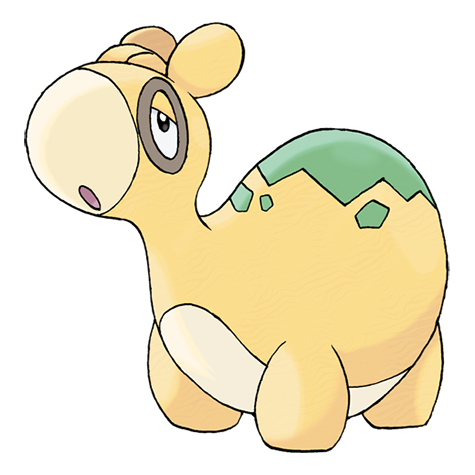

# Numel (#0322)

*Numb Pokemon*

**Type:** Fuoco / Terra
**Abilities:** [[Oblivious]], [[Simple]], [[Own Tempo]] *(Hidden)*
**Base HP:** 3

> An incredibly dim-witted Pokemon. They don’t notice being hit. If they get hungry they faint. Numel's body is a cauldron of boiling magma. In rainy days, the magma cools and its speed is lowered.

---

## Statistiche (Attributes & Limits)

| Attribute | Base / Limit |
|---|---|
| **Strength** | 2/4 |
| **Dexterity** | 1/3 |
| **Vitality** | 1/3 |
| **Special** | 2/4 |
| **Insight** | 2/4 |

---

## Mosse (Learnset)

- **Starter:** [[Growl|Growl]], [[Tackle|Tackle]]
- **Beginner:** [[Ember|Ember]], [[Magnitude|Magnitude]]
- **Amateur:** [[Focus_Energy|Focus Energy]], [[Flame_Burst|Flame Burst]], [[Amnesia|Amnesia]], [[Lava_Plume|Lava Plume]], [[Earth_Power|Earth Power]], [[Curse|Curse]], [[Take_Down|Take Down]], [[Yawn|Yawn]]
- **Ace:** [[Earthquake|Earthquake]], [[Flamethrower|Flamethrower]], [[Double_Edge|Double-Edge]]
- **Pro:** [[Mud_Bomb|Mud Bomb]], [[Growth|Growth]], [[Endure|Endure]]

---

## Correlati

### Catena Evolutiva
- [[0322_Numel|Numel]]
- [[0323_Camerupt|Camerupt]]
- Camerupt (Mega Form)
