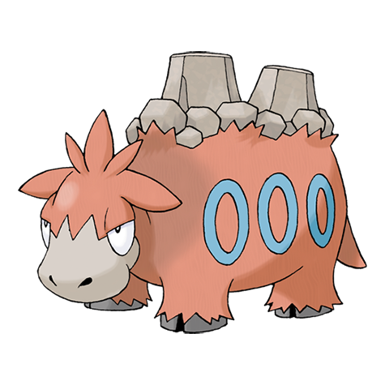

# Camerupt (Mega Form) (#0323M1)

*Eruption Pokemon*

**Type:** Fuoco / Terra
**Abilities:** [[Sheer Force]]
**Base HP:** 5

> The power of the Mega Stone melts its two humps into a single one. The single hump is heavier making it slower, but its newly renewed attitude makes the hump erupt in heavy bursts of molten lava.

---

## Statistiche (Attributes & Limits)

| Attribute | Base / Limit |
|---|---|
| **Strength** | 3/7 |
| **Dexterity** | 1/2 |
| **Vitality** | 3/6 |
| **Special** | 4/8 |
| **Insight** | 3/6 |

---

## Mosse (Learnset)

- **Starter:** [[Growl|Growl]], [[Tackle|Tackle]]
- **Beginner:** [[Ember|Ember]], [[Magnitude|Magnitude]]
- **Amateur:** [[Focus_Energy|Focus Energy]], [[Flame_Burst|Flame Burst]], [[Amnesia|Amnesia]], [[Lava_Plume|Lava Plume]], [[Earth_Power|Earth Power]], [[Curse|Curse]], [[Take_Down|Take Down]], [[Yawn|Yawn]]
- **Ace:** [[Rock_Slide|Rock Slide]], [[Earthquake|Earthquake]], [[Eruption|Eruption]], [[Fissure|Fissure]]
- **Pro:** [[Stealth_Rock|Stealth Rock]], [[Self_Destruct|Self Destruct]], [[Heat_Wave|Heat Wave]]

---
