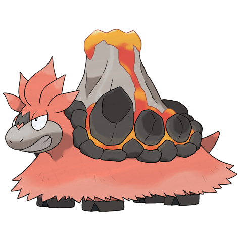

# Camerupt (#0323)

*Eruption Pokemon*

**Type:** Fuoco / Terra
**Abilities:** [[Magma Armor]], [[Solid Rock]], [[Anger Point]] *(Hidden)*
**Base HP:** 4

> Sometimes the humps on their back make an eruption when they get really angry, otherwise they’d only erupt every 10 years. Camerupts live inside the craters of volcanoes. They are indifferent to humans.

---

## Statistiche (Attributes & Limits)

| Attribute | Base / Limit |
|---|---|
| **Strength** | 3/6 |
| **Dexterity** | 1/3 |
| **Vitality** | 2/5 |
| **Special** | 3/6 |
| **Insight** | 2/5 |

---

## Mosse (Learnset)

- **Starter:** [[Growl|Growl]], [[Tackle|Tackle]]
- **Beginner:** [[Ember|Ember]], [[Magnitude|Magnitude]]
- **Amateur:** [[Focus_Energy|Focus Energy]], [[Flame_Burst|Flame Burst]], [[Amnesia|Amnesia]], [[Lava_Plume|Lava Plume]], [[Earth_Power|Earth Power]], [[Curse|Curse]], [[Take_Down|Take Down]], [[Yawn|Yawn]]
- **Ace:** [[Rock_Slide|Rock Slide]], [[Earthquake|Earthquake]], [[Eruption|Eruption]], [[Fissure|Fissure]]
- **Pro:** [[Stealth_Rock|Stealth Rock]], [[Self_Destruct|Self Destruct]], [[Heat_Wave|Heat Wave]]

---

## Correlati

### Catena Evolutiva
- [[0322_Numel|Numel]]
- [[0323_Camerupt|Camerupt]]
- Camerupt (Mega Form)

---

## Mega Camerupt (#0323M1)

**Type:** Fuoco / Terra
**Abilities:** [[Sheer Force]]
**Base HP:** 5

| Attribute | Base / Limit |
|---|---|
| **Strength** | 3/7 |
| **Dexterity** | 1/2 |
| **Vitality** | 3/6 |
| **Special** | 4/8 |
| **Insight** | 3/6 |

### Mosse

- **Starter:** [[Growl|Growl]], [[Tackle|Tackle]]
- **Beginner:** [[Ember|Ember]], [[Magnitude|Magnitude]]
- **Amateur:** [[Focus_Energy|Focus Energy]], [[Flame_Burst|Flame Burst]], [[Amnesia|Amnesia]], [[Lava_Plume|Lava Plume]], [[Earth_Power|Earth Power]], [[Curse|Curse]], [[Take_Down|Take Down]], [[Yawn|Yawn]]
- **Ace:** [[Rock_Slide|Rock Slide]], [[Earthquake|Earthquake]], [[Eruption|Eruption]], [[Fissure|Fissure]]
- **Pro:** [[Stealth_Rock|Stealth Rock]], [[Self_Destruct|Self Destruct]], [[Heat_Wave|Heat Wave]]
