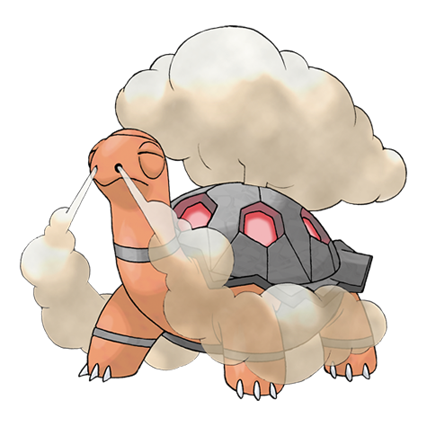

# Torkoal (#0324)

*Coal Pokemon*

**Type:** Fuoco
**Abilities:** [[White Smoke]], [[Drought]], [[Shell Armor]] *(Hidden)*
**Base HP:** 4

> They constantly search for coal to add to their shell, digging mountains tirelessly because it is the source of their power. If they run out of coal, they grow weak. They are commonly found in abandoned coal mines.

---

## Statistiche (Attributes & Limits)

| Attribute | Base / Limit |
|---|---|
| **Strength** | 2/5 |
| **Dexterity** | 1/3 |
| **Vitality** | 3/7 |
| **Special** | 2/5 |
| **Insight** | 2/5 |

---

## Mosse (Learnset)

- **Starter:** [[Ember|Ember]], [[Smog|Smog]]
- **Beginner:** [[Withdraw|Withdraw]], [[Curse|Curse]]
- **Amateur:** [[Fire_Spin|Fire Spin]], [[Smokescreen|Smokescreen]], [[Flame_Wheel|Flame Wheel]], [[Rapid_Spin|Rapid Spin]], [[Flamethrower|Flamethrower]], [[Body_Slam|Body Slam]], [[Protect|Protect]], [[Lava_Plume|Lava Plume]], [[Iron_Defense|Iron Defense]], [[Amnesia|Amnesia]]
- **Ace:** [[Flail|Flail]], [[Heat_Wave|Heat Wave]], [[Inferno|Inferno]], [[Shell_Smash|Shell Smash]]
- **Pro:** [[Clear_Smog|Clear Smog]], [[Superpower|Superpower]], [[Fissure|Fissure]]

---

