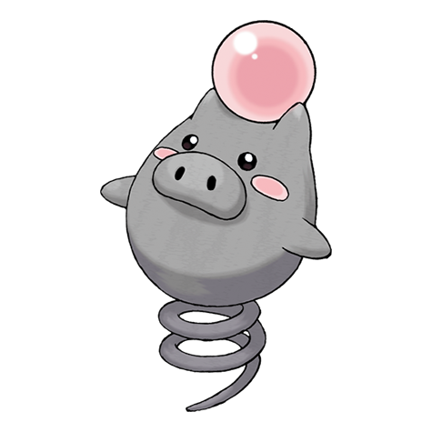

# Spoink (#0325)

*Bounce Pokemon*

**Type:** Psico
**Abilities:** [[Thick Fat]], [[Own Tempo]], [[Gluttony]] *(Hidden)*
**Base HP:** 3

> They are always bouncing with their tail. If they ever stop, their heart wouldn’t beat anymore. Spoinks balance a pearl from Clamperl on their head, if it’s lost, they won’t be able to control their psychic powers.

---

## Statistiche (Attributes & Limits)

| Attribute | Base / Limit |
|---|---|
| **Strength** | 1/3 |
| **Dexterity** | 2/4 |
| **Vitality** | 1/3 |
| **Special** | 2/5 |
| **Insight** | 2/5 |

---

## Mosse (Learnset)

- **Starter:** [[Splash|Splash]]
- **Beginner:** [[Psywave|Psywave]], [[Odor_Sleuth|Odor Sleuth]]
- **Amateur:** [[Psybeam|Psybeam]], [[Psych_Up|Psych Up]], [[Confuse_Ray|Confuse Ray]], [[Magic_Coat|Magic Coat]], [[Zen_Headbutt|Zen Headbutt]], [[Rest|Rest]], [[Power_Gem|Power Gem]]
- **Ace:** [[Psyshock|Psyshock]], [[Payback|Payback]], [[Psychic|Psychic]], [[Bounce|Bounce]]
- **Pro:** [[Role_Play|Role Play]], [[Signal_Beam|Signal Beam]], [[Extrasensory|Extrasensory]]

---

## Correlati

### Catena Evolutiva
- [[0325_Spoink|Spoink]]
- [[0326_Grumpig|Grumpig]]
