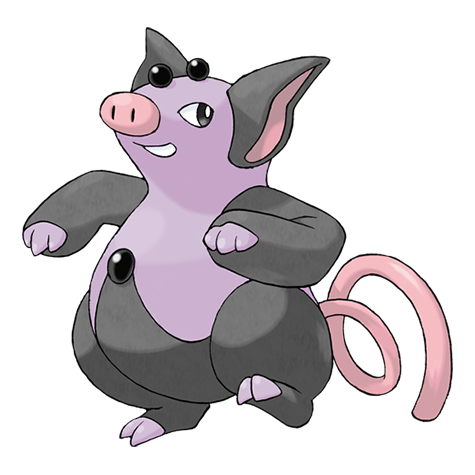

# Grumpig (#0326)

*Manipulate Pokemon*

**Type:** Psico
**Abilities:** [[Thick Fat]], [[Own Tempo]], [[Gluttony]] *(Hidden)*
**Base HP:** 4

> Grumpigs control their foes with their psychic powers amplified by the pearls on their head and a hypnotic dance. However, when they use their powers, they have a difficult time breathing.

---

## Statistiche (Attributes & Limits)

| Attribute | Base / Limit |
|---|---|
| **Strength** | 2/4 |
| **Dexterity** | 2/5 |
| **Vitality** | 2/4 |
| **Special** | 2/5 |
| **Insight** | 3/6 |

---

## Mosse (Learnset)

- **Starter:** [[Splash|Splash]]
- **Beginner:** [[Belch|Belch]], [[Psywave|Psywave]], [[Odor_Sleuth|Odor Sleuth]]
- **Amateur:** [[Psybeam|Psybeam]], [[Psych_Up|Psych Up]], [[Confuse_Ray|Confuse Ray]], [[Magic_Coat|Magic Coat]], [[Zen_Headbutt|Zen Headbutt]], [[Rest|Rest]], [[Snore|Snore]], [[Teeter_Dance|Teeter Dance]], [[Power_Gem|Power Gem]]
- **Ace:** [[Psyshock|Psyshock]], [[Payback|Payback]], [[Psychic|Psychic]], [[Bounce|Bounce]]
- **Pro:** [[Drain_Punch|Drain Punch]], [[Future_Sight|Future Sight]], [[Trick|Trick]]

---

## Correlati

### Catena Evolutiva
- [[0325_Spoink|Spoink]]
- [[0326_Grumpig|Grumpig]]
