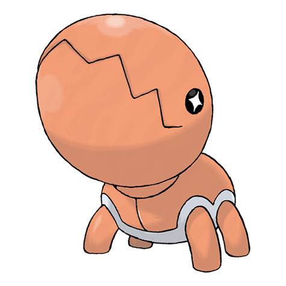

# Trapinch (#0328)

*Ant Pit Pokemon*

**Type:** Terra
**Abilities:** [[Hyper Cutter]], [[Arena Trap]], [[Sheer Force]] *(Hidden)*
**Base HP:** 3

> Their nest is like a bowl pit dug in sand. Trapinches wait for prey to tumble down their pit, later to be crushed between this Pokemon’s jaws. Beware of them as their bite can cause serious damage.

---

## Statistiche (Attributes & Limits)

| Attribute | Base / Limit |
|---|---|
| **Strength** | 3/6 |
| **Dexterity** | 1/2 |
| **Vitality** | 2/4 |
| **Special** | 2/4 |
| **Insight** | 2/4 |

---

## Mosse (Learnset)

- **Starter:** [[Bite|Bite]]
- **Beginner:** [[Sand_Attack|Sand Attack]], [[Feint_Attack|Feint Attack]]
- **Amateur:** [[Sand_Tomb|Sand Tomb]], [[Mud_Slap|Mud Slap]], [[Bide|Bide]], [[Bulldoze|Bulldoze]], [[Rock_Slide|Rock Slide]], [[Dig|Dig]], [[Crunch|Crunch]], [[Earth_Power|Earth Power]], [[Sandstorm|Sandstorm]]
- **Ace:** [[Feint|Feint]], [[Earthquake|Earthquake]], [[Hyper_Beam|Hyper Beam]], [[Superpower|Superpower]], [[Fissure|Fissure]]
- **Pro:** [[Bug_Bite|Bug Bite]], [[Headbutt|Headbutt]], [[Giga_Drain|Giga Drain]]

---

## Correlati

### Catena Evolutiva
- [[0328_Trapinch|Trapinch]]
- [[0329_Vibrava|Vibrava]]
- [[0330_Flygon|Flygon]]
