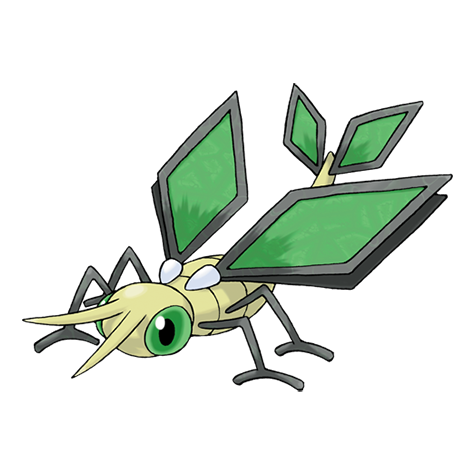

# Vibrava (#0329)

*Vibration Pokemon*

**Type:** Terra / Drago
**Abilities:** [[Levitate]]
**Base HP:** 4

> This Pokemon’s vibrations can cause severe headaches or even fainting. If their prey faints, they proceed to melt them with acid. Vibrava's wings are still growing, making it a clumsy flier with low endurance.

---

## Statistiche (Attributes & Limits)

| Attribute | Base / Limit |
|---|---|
| **Strength** | 3/6 |
| **Dexterity** | 2/4 |
| **Vitality** | 2/4 |
| **Special** | 2/4 |
| **Insight** | 2/4 |

---

## Mosse (Learnset)

- **Starter:** [[Sonic_Boom|Sonic Boom]]
- **Beginner:** [[Sand_Attack|Sand Attack]], [[Feint_Attack|Feint Attack]]
- **Amateur:** [[Sand_Tomb|Sand Tomb]], [[Mud_Slap|Mud Slap]], [[Bide|Bide]], [[Bulldoze|Bulldoze]], [[Rock_Slide|Rock Slide]], [[Supersonic|Supersonic]], [[Bug_Buzz|Bug Buzz]], [[Screech|Screech]], [[Dragon_Breath|Dragon Breath]], [[Earth_Power|Earth Power]]
- **Ace:** [[Sandstorm|Sandstorm]], [[Earthquake|Earthquake]], [[Hyper_Beam|Hyper Beam]], [[Boomburst|Boomburst]]
- **Pro:** [[Dragon_Pulse|Dragon Pulse]], [[Toxic|Toxic]], [[Tailwind|Tailwind]]

---

## Correlati

### Catena Evolutiva
- [[0328_Trapinch|Trapinch]]
- [[0329_Vibrava|Vibrava]]
- [[0330_Flygon|Flygon]]
