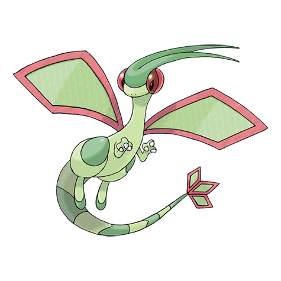

# Flygon (#0330)

*Mystic Pokemon*

**Type:** Terra / Drago
**Abilities:** [[Levitate]]
**Base HP:** 5

> Known as the “Elemental Spirit of the Desert”. Their wings create a cloud of dust that surrounds this Pokemon while flying, while their flapping produces a sound that resembles a woman singing.

---

## Statistiche (Attributes & Limits)

| Attribute | Base / Limit |
|---|---|
| **Strength** | 3/6 |
| **Dexterity** | 3/6 |
| **Vitality** | 2/5 |
| **Special** | 2/5 |
| **Insight** | 2/5 |

---

## Mosse (Learnset)

- **Starter:** [[Sonic_Boom|Sonic Boom]]
- **Beginner:** [[Feint_Attack|Feint Attack]], [[Sand_Attack|Sand Attack]]
- **Amateur:** [[Mud_Slap|Mud Slap]], [[Sand_Tomb|Sand Tomb]], [[Bulldoze|Bulldoze]], [[Bide|Bide]], [[Supersonic|Supersonic]], [[Rock_Slide|Rock Slide]], [[Dragon_Breath|Dragon Breath]], [[Screech|Screech]], [[Dragon_Tail|Dragon Tail]], [[Earth_Power|Earth Power]], [[Uproar|Uproar]]
- **Ace:** [[Sandstorm|Sandstorm]], [[Hyper_Beam|Hyper Beam]], [[Dragon_Dance|Dragon Dance]], [[Earthquake|Earthquake]], [[Dragon_Claw|Dragon Claw]], [[Dragon_Rush|Dragon Rush]]
- **Pro:** [[Outrage|Outrage]], [[Heat_Wave|Heat Wave]], [[Draco_Meteor|Draco Meteor]]

---

## Correlati

### Catena Evolutiva
- [[0328_Trapinch|Trapinch]]
- [[0329_Vibrava|Vibrava]]
- [[0330_Flygon|Flygon]]
