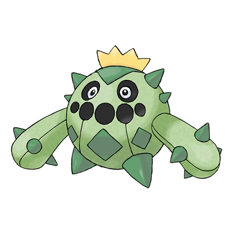

# Cacnea (#0331)

*Cactus Pokemon*

**Type:** Erba
**Abilities:** [[Sand Veil]], [[Water Absorb]] *(Hidden)*
**Base HP:** 3

> They release a strong and sweet aroma to attract prey, if they get closer, Cacneas shoot sharp thorns to bring them down. They resemble cactuses and hide among them.

---

## Statistiche (Attributes & Limits)

| Attribute | Base / Limit |
|---|---|
| **Strength** | 2/5 |
| **Dexterity** | 1/3 |
| **Vitality** | 1/3 |
| **Special** | 2/5 |
| **Insight** | 1/3 |

---

## Mosse (Learnset)

- **Starter:** [[Poison_Sting|Poison Sting]], [[Leer|Leer]]
- **Beginner:** [[Absorb|Absorb]], [[Growth|Growth]]
- **Amateur:** [[Leech_Seed|Leech Seed]], [[Sand_Attack|Sand Attack]], [[Pin_Missile|Pin Missile]], [[Ingrain|Ingrain]], [[Feint_Attack|Feint Attack]], [[Spikes|Spikes]], [[Energy_Ball|Energy Ball]], [[Payback|Payback]]
- **Ace:** [[Sucker_Punch|Sucker Punch]], [[Needle_Arm|Needle Arm]], [[Cotton_Spore|Cotton Spore]], [[Sandstorm|Sandstorm]], [[Destiny_Bond|Destiny Bond]]
- **Pro:** [[Acid|Acid]], [[Switcheroo|Switcheroo]], [[Drain_Punch|Drain Punch]]

---

## Correlati

### Catena Evolutiva
- [[0331_Cacnea|Cacnea]]
- [[0332_Cacturne|Cacturne]]
